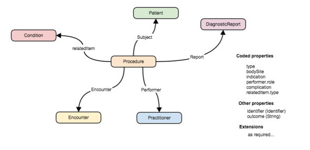
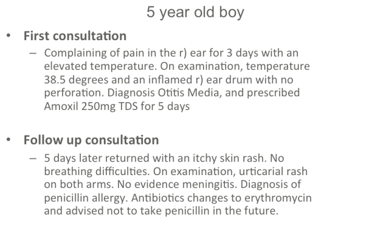
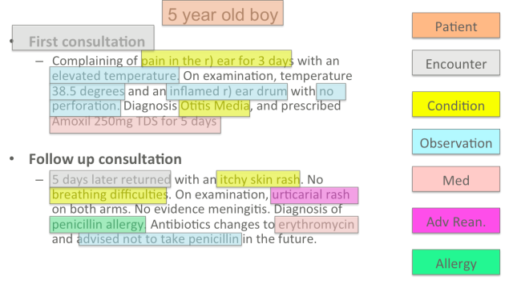
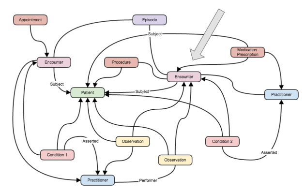

[原文链接:Clinical resources in FHIR](http://fhirblog.com/2014/11/13/clinical-resources-in-fhir/)
## Clinical resources in FHIR
**译者注:大多数技术标准尤其医疗健康领域的通常情况下为人所诟病，要么说不贴近临床实际的应用场景，要么说技术过于晦涩难懂，不利于实现，本文作者尝试从临床的角度去阐释FHIR中的资源，应该怎么样使用FHIR中的资源(医学概念)来表述一个完整的临床流程。主要是针对作者最近在Melbourne的一个FHIR研讨会上的PPT的介绍。

核心的理念在于FHIR资源，就如同web页面的构件一样组装起来就能够表述一个完整的临床流程，下图就是一个简单的范例,为大家展示了FHIR资源的核心特征：
* 资源之间是相互关联的 像一张网，或者说图，每个资源都是一个点
* 资源中有一些可以编码的属性  会用到各种字典
* 资源中也会有一些简单数据类型的属性、字段
* 资源也会存在扩展

下图给大家看一个相对简单，但在全科诊疗中也很罕见的场景

我们在看一下上面的场景中我们需要用到哪些资源

要注意的是 上面颜色标注的也不全是对的，详情可以在Patient Care workgroup的邮件列表中进行探讨.
如果用图的形式来表示的话,可能会是下面的样子

