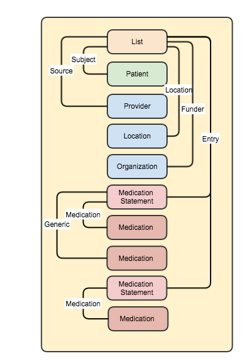

[原文链接:FHIR Medication lists revisited](http://fhirblog.com/2014/10/13/medication-lists-revisited/)
## FHIR Medication lists revisited
**译者注:用药信息是每个医疗信息标准都迈步过去的坎儿，能不能准确便捷的表达临床流程的信息流转，满足大多数医疗信息系统的需求，作者也绕着这个梗给大家分享了一些自己的想法。

[如何使用List来表达患者的用药列表信息](http://fhirblog.com/2013/10/31/representing-a-patients-list-of-medications-in-fhir/)     
[如何使用transaction来对患者用药列表信息进行更新操作](http://fhirblog.com/2013/10/31/representing-a-patients-list-of-medications-in-fhir/)    
[区域范围内该共享哪些用药信息](http://fhirblog.com/2013/11/04/regional-shared-medications-with-fhir/)    

### 业务需求

这里面主要是探讨如何对用药信息进行评估(medication review 查阅了一些中文材料 这里最合适的翻译是临床用药评估，见参考资料1)(当然可能是一种理想化的情况)，又大致可以分为：全面的临床评估，出院前的变更，患者个人反映自己正在服用的某些药物并不在最近的处方列表内。

对于要使用此类信息的系统而言，怎么样最简单最快的能够获得"最近的列表"(最近的一次评估，或许是一种或几种类型)以及既往的变更记录。如果能够保证此类信息及时可靠的话能够极大的降低成本。

对于每一次用药评估而言，我们需要记录：
* 评估的日期  时间
* 评估的人员
* 评估的类型(新增药物的更新操作还是说整体全面的所有用药的评估)
* 评估的地点 医院，全科诊所，药房
* 评估的赞助人员
* 评估之前的用药列表
* 评估之后的用药列表，发生了哪些变化以及发生的原因，停用的药物啊，现用药的剂量等的变化呀

对于其中每一种药物，需要记录：
* 药品名称，编码
* 药品通用名和编码
* 剂量信息
* Patient instructions
* 开药的原因
* 诊疗的时间区间

为了获得如上的评估信息，我们要能够：
* 检索病人一种或多种最近的List(用药列表)
* 根据类型，拿到list变更的摘要信息
* 检索某个List的既往变更记录
* 更新这个List
* 其他。。。。

这里我们主要探讨如何对List进行建模，后续的文章里再来看看技术上如何实现。

之前的文章里已经使用过MedicationPrescription资源，其中包括用药的原因，剂量，如何服用，治疗的时间区间等等，这个主要是下医嘱时来用(患者还没有用这些药 针对某次就诊事件而言 有限定的事件点)，这里我们使用MedicationStatement (用过的，还没用的用药记录 范围更广)。

选了MedicationStatement 意味着我们得添加一些扩展才能满足我们的需要；

* Generic medication (#generic – Reference to Medication resource). The medication resource has an ‘isBrand’ so we can tell if we need the extension.
* Reason for prescription (#reason – String)
* Patient Instructions (#patientinstructions – String)
* Duration of treatment (#duration – Period)

至于说如何在profile里面定义上面提到的扩展，取什么名字，选什么数据类型。

接下来看一看如何使用List。这里面要有 patient (List.subject), who did it (List.source) and date/time (List.date)，List.code表示List的类型(loinc 10160-0 – history of medication use).

这里可能也要定义一些扩展，
* 评估进行的地点，可以使用Location资源，定义一个ResourceReference类型的扩展即可
* 赞助者，可以使用Organization  定义一个ResourceReference类型的扩展即可

接下来，考虑如何表示变化前和变化后的List
* 可以通过将最新的List与之前的List进行比较得知变化。但如何记录变更的原因是很复杂的，同样，如何得知前一个List的信息是评估人员选择的那个List
* 一种更合理的方式是使用List.entry元素配合扩展，entry.flag用来记录工作流相关的信息，比如说用药是新增的，还是和之前一样，还是说变化了或者终止了。entry.deleted用来表示用药是否停止了，该元素是一个‘modifier’ 元素，客户端必须理解。entry.changeReason (extension)用该扩展来记录变更的理由，可以使用CodeableConcept 数据类型，预设几种理由的编码即可。
<table>
<tbody>
<tr>
<td width="106">Scenario</td>
<td width="106">Flag</td>
<td width="106">Deleted</td>
<td width="106">ChangeReason</td>
</tr>
<tr>
<td width="106">Existing Medication</td>
<td width="106">existing</td>
<td width="106">false</td>
<td width="106"></td>
</tr>
<tr>
<td width="106">Changed Medication</td>
<td width="106">changed</td>
<td width="106">false</td>
<td width="106">Reason for change</td>
</tr>
<tr>
<td width="106">New medication</td>
<td width="106">new</td>
<td width="106">false</td>
<td width="106">Why started</td>
</tr>
<tr>
<td width="106">Stopped Mediation</td>
<td width="106">stopped</td>
<td width="106">true</td>
<td width="106">Why stopped</td>
</tr>
</tbody>
</table>

entry.flag的数据类型为CodeableConcept，标准中给出了一个字典的例子，[1.14.2.1.89.1 Patient Medicine Change Types](http://www.hl7.org/implement/standards/fhir/valueset-list-item-flag.html),当然我们可以根据自己的需要进行扩展，或自己造一个字典ValueSets 。

仍需考虑的List的mode，如果是要记录一系列的评估，可能该mode值为changes，
综上所述，我们得到如下的结果

参考资料
1. [临床用药评估制度](http://wenku.baidu.com/link?url=38peKkUNkZBsDtv4TAhQxLNiQQts009KjguWd2J_WS8BbsDAu8_VCTROV41dYhWK-ejhVOzMGGwK1rWNKkPrvGG1Z8bsdPL6h34c5iWR4Wa)