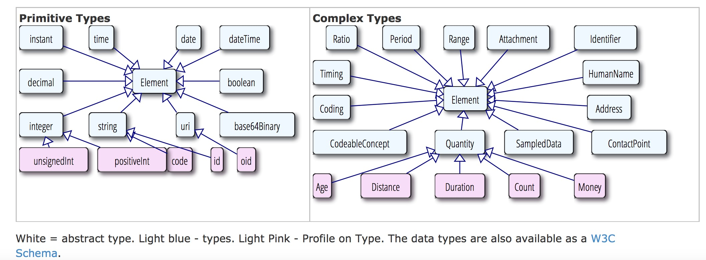

# 数据类型说明和示例      

　　FHIR 标准中规定了两大类数据类型：简单/基本数据类型和复杂数据类型。如下图所示：


## 1 基本数据类型
下表总结了在整个规范中基本类型及其简单的限制条件，基本类型指那些没有子属性的类型，尽管它们的原语，像所有类型，都有扩展属性。基本类型的值与W3C架构（1.0）规范的第二部分定义的值具有相同的值域，
大多数情况下，本规范附加约束使用粗体标记来。

基本数据类型

| 名称 | 	类型 |  描述  | 
| ---- | 	---- |  -----  | 
 | boolean	 | xs:boolean	 | 值可以为true或者false（0和1是无效的值） | 
 | integer | 	xs:int	 | 32位整数（对于更大的值，使用decimal） | 
 | decimal | 	xs:decimal | 	一个有理数。注意：在实现中，不要使用IEEE浮点类型。而是使用类似于内置精度的小数的形式（例如Java BigDecimal）。Decimal不可以使用指数。 | 
 | base64Binary | xs:base64Binary | base64以(RFC 4648)编码的字节流 | 
 | instant | xs:dateTime | 一瞬间的时间-精确至少到秒，常常包含时区。注意：这种类型是系统时间，不是人类时间。（如date 和 dateTime）
 | string | xs:string | 1.	一个Unicode字符序列。注意，字符串大小不能超过1MB | 
 | uri	 | xs:anyURI | 统一资源标识符的参考。它可以是绝对的或相对的，也可能是一个可选的片段标识符（RFC 3986） | 
 | date | union of xs:date, xs:gYearMonth, xs:gYear | 在人们交流时时使用的日期或部分日期（比如年或年+月）。没有时区。日期应该是有效日期，并且是W3C模式类型日期，如gYearMonth，和gYear。正则表达式：-?[0-9]{4}(-(0[1-9]|1[0-2])(-(0[0-9]|[1-2][0-9]|3[0-1]))?)?
 | dateTime | union of xs:dateTime, xs:date, xs:gYearMonth, xs:gYear |在人们交流时时使用的日期，日期时间或部分日期（比如年或年+月）。如果指定小时和分钟，通常应该加上时区。可以加上秒，也可以不加。日期应该是有效日期，如“24:00”是可以的。日期是W3C模式类型日期，如gYearMonth，和gYear。 正则表达式：<code>-?[0-9]{4}(-(0[1-9]|1[0-2])(-(0[0-9]|[1-2][0-9]|3[0-1])(T([01][0-9]|2[0-3]):[0-5][0-9]:[0-5][0-9](\.[0-9]+)?(Z|(\+|-)((0[0-9]|1[0-3]):[0-5][0-9]|14:00))?)?)?)? </code>| 
 | time | xs:time | 一天内的某个时间，没有指定日期（可以转化成自午夜算起的Duration数据类型）。秒可以加上也可以不加上。如“24:00”
是可以的正则表达式：<code>([01][0-9]|2[0-3]):[0-5][0-9]:[0-5][0-9](\.[0-9]+)?</code>注意：不是任意规定格式的日期类型都可以用正则表达式来表示，这些正则表达式要求这些日期必须是有效格式的日期


 限制条件
 
 | 名称	 | 基本数据类型 | 	描述 | 
 | ---- | 	---- |  -----  | 
 | code	 | string	 | 表示该值是从其他地方定义的一组控制串（请参阅使用的代码进行进一步讨论）。从技术上讲，一个code类型被限制为字符串，它至少有一个字符，开头或结尾都没有空格，内容中不能出现连续的空格符正则表达式：[^\s]+([\s]+[^\s]+)* | 
 | oid	 | uri | 	用URI（RFC3001）表示的OID，如: urn:oid:1.2.3.4.5 | 
 | uuid	 | uri | 	用URI（RFC4122）表示的UUID：urn:uuid:a5afddf4-e880-459b-876e-e4591b0acc11。RFC的注解：UUID值应使用小写字母，但系统应不区分大小写。 | 
 | id	 | string	任意大写或小写ASCII字母的组合（'A'..'Z', 和'a'..'z',数字('0'..'9'), '-' 和 '.',限制在64位字符长度
以内。这些可能是整型，一个无前缀的OID, UUID或者满足这些约束条件的任何其他标识模式。）Ids区分大小写。UUIDs必须用小写字母。注意：这个版本格式通常使用ISO18232标识符格式，也可以使用除ISO18232以外不区分大小写的标识符格式 | 

除了具有如上所述的值外，这些基本数据类型也可以具有一个身份（例如XML：ID），并且它们可以具有像其他资源资源的任何元素一样的扩展性。需要注意的是，根据以下所有元素的标准规则，该值是可选的，并且可能不存在。例如，一个基本元素可能是没有价值的，包括数据缺失等
在XML中，这些数据类型被表示为XML元素的值类型和值属性。元素的名称和类型同时被定义。 XML元素可以有一个id属性，子元素命名为“extension”。根据XML模型，这些类型的值属性的前后空格都可以省去，包括boolean, integer, decimal, base64Binary, instant, uri, date, dateTime, oid, and uri。这意味着，当读取XML实例时，使用XML模型和不使用XML模型最后得到的值的属性是不同的。因此，这些类型的值属性前缀和后缀不应该有空格。空格只能出现在字符串中。
在JSON中，这些数据类型代表包含它们的对象的简单属性。该属性名称和类型需要同时定义。该类型仍然有一个id属性和扩展。怎样通过JSON格式来描述这些属性。JSON中空格是很有意义的。基本数据类型的前缀后后缀不能有空格。
 7.2  Attachment 附件
该数据类型适用于包含或引用各种附件，也就是用其他格式所定义的外部的数据内容。
常见的使用这种类型的，在一些报表格式，如PDF包含图像或报告。然而，它可以用于具有mime类型的任何数据。

Structure
Name	Flags	Card.	Type
	Description & Constraints
描述和限制条件
   Attachment
I	1..1	Element
按照一定格式定义的内容，若存在data字段，它应具有一个contentType类型
    contentType
	0..1	code
Mnme类型的内容，字符集等，编码取自MimeType (Required)
    language
	0..1	code
人类语言，编码取自Language (Required)
    data
	0..1	base64Binary
内嵌的base64编码的数据
    url
	0..1	uri
通过uri可找到数据
    size
	0..1	integer
内容的字节数
    hash
	0..1	base64Binary
数据的hash值(sha-1, base64ed)
    title
	0..1	string
数据的标签
ContentType元素应始终填充。根据情况，它可以包含字符集信息和其他MIME类型扩展。在contentType中如果没有设置字符集，那么操作中会出现问题，但有些媒体类型可以使用默认的字符集，字符集可以通过内容的检查来确定。
附件的实际内容可以直接使用数据元素或者可以提供一个URL引用来表示。如果两者都设置，则引用指向的内容应该和数据的内容一致。引用不能被重用，即同一个引用指向一些不同的数据（即参考特定版本）。该URL引用应指向解析为实际数据的位置;一些URI如CID：满足这一要求。如果URL是相对引用，对于同一个资源引用，它可以理解为指向同样的路径。
应可以根据hash值来验证URL返回的内容是否被改变。
在很多使用附件的情况下，该附件基数大于1。有效重复利用可以传达使用不同MIME类型和语言的相同内容。关于重复利用元素的意义说明应该在该重复资源元素定义或指定该类型扩展引用的时候提供。对附件的语言描述使用的是BCP47编码。
约束条件
	Inv-1:如果附件存在data字段，它必须有一个contentType类型
(xpath: not(exists(f:data)) or exists(f:contentType))
	若data  和url字段都不存在，value字段中应表明不存在规定的mimeType或语言的数据
	使用时可以规定附件的格式和类型，也就是可以使用的mime types.
Attachment常用于:
Communication, Practitioner, QuestionnaireAnswers,CommunicationRequest, Observation, SupportingDocumentation, RelatedPerson, Person, Media, DiagnosticReport,Contract and Patient
7.4 Coding 编码
编码是使用“编码系统”里面定义好的一些符号来表示和定义相关概念
Structure
Name	Flags	Card.	Type	Description & Constraints
描述和限制条件
   Coding
I	1..1	Element
对定义编码的术语的引用，如果有提供ValueSet，Coding.system字段必须赋值。
    system
	0..1	uri
术语系统的标识符
    version
	0..1	string
术语系统的版本号
    code
	0..1	code
由该编码系统所定义的语法符号
    display
	0..1	string
由该编码系统所定义的文本表示方法
    primary
	0..1	boolean
如果该编码是否是用户优选项的标记
    valueSet
	0..1	ValueSet
该编码取自哪个值集

编码的含义是由代码来定义。系统提供代码定义的源，以及一个可选的参考版本。display是human display，用于由系统定义的文本 – 它没有加入其他的值。该值对内容中选择的代码信息提供参考。
System字段的值是所引用的字典/代码系统的URI。该URI可能：
•	一个已经存在的系统列表中定义的URI
•	一个已经在HL7 OID注册过的OID (urn:oid:) 或UUID (urn:uuid:).。
•	一个直接引用该系统定义的URL，它可以参考部分ValueSet资源的代码系统（即在ValueSet.define.system的值）
•	或者唯一标识代码系统定义的任何其他URI
对于某个字典/编码体系而言，System的正确取值可以结合按照下面的顺序：
•	标准中已经罗列出来的字典列表
•	HL7 OID注册库
•	和字典/编码系统有关的文档
•	咨询代码系统的所有者
•	在HL7词汇邮件列表中提问

有时候可能会提供代码系统的版本。如果编码的含义在代码系统中不同的版本一致，则可不提供系统版本。当编码系统的不同版本不能保持语义的一致性时，必须提供version字段。如果引用的是一个值集合，并且该值集合不是由其他编码系统中的编码所形成的，而是它自身定义了一些编码，一定程度上，这个值集也就是一个简单的编码系统，如果在该值集定义编码时指定了version字段的取值，则两个version字段(ValueSet.define.version和Coding.version)的值应保持一致。请注意使用以下系统必须给version字段赋值：
•	LOINC编码系统
•	不同版本的ICD
•	某些国家发布的SNOMED CT（在不同行政辖区之间，定义的一致性会不同，甚至一些行政辖区会指定他们自己的规则）

如果使用了code字段，编码必须是原始系统所定义的符号。在某些编码系统如SNOMED CT，可能是其他一些预定义的符号（如post-coordination）组成的表达式。需要注意的是，除非代码系统指定，否则区分大小写。display 是由系统定义代码的文本表示，在不了解系统的情况下通过一个应用来展示代码的含义。
如果编码系统定义了多个展示用的字符串，至少在display字段中应该使用其中一个。如果某个被标记为优选项，它应被优先使用。如果编码系统中没有定义文本表示（例如SNOMED CT的表达式），那么display字段不能有值，不能理解编码的表达式的系统也无法获取编码的含义。
在一些情况下，可能不知道出自哪个字典system - 只知道code编码。在这种情况下，除非该系统可以由上下文安全地判断，否则不能对编码进行处理。信息在更大范围内共享是可预见的，不能在不知道字典的情况下使用code编码，应尽可能避免出现这种做法。
如果知道是哪个字典，但没有编码，可以理解为，在系统中没有合适的代码来表达这个含义。
如果两个编码system、 version 和code 字段值都相同，则两个编码表达的是相同的含义。如果version不存在，或者system, version和code取值不同，这两个编码的关系需要在编码系统中和已有的映射关系中查找。
如果用户在界面中选择了某个特殊的编码值，可以将其标记为主编码，在进行翻译等操作的时候，主编码是优先考虑的。
有时候会在valueset字段中提供对某个valueset的引用值，以帮助用户或系统来理解编码的上下文。在某些情况下，编码取自哪里会影响着编码的含义。这里需要注意的是Coding.system字段的值并不能替代Coding.valueSet。Coding.system字段中URI的值不能指向一个valueset的引用。（如果value set中的编码是它自己所定义的，那么该使用ValueSet.define.system而不是Coding.system字段，并且这个value set包含对这个valueset资源的直接引用。
约束条件
如果使用了Coding.valueSet字段,则Coding.system字段必须赋值，且其值与ValueSet.define.system 或ValueSet.compose.include.system一致。
  <Coding>
    <system value="http://hl7.org/fhir/RS-link" />
    <code value="+" />
    <valueSet>
      <reference url="http://hl7.org/fhir/ValueSet/RS-link" />
    </valueSet>
  </Coding>

在以下内容中使用Coding类型
CodeableConcept, ValueSet, OralHealthClaim, Coverage, Composition,Conformance, Profile, StatusResponse, PharmacyClaim, Reversal, EligibilityRequest, QuestionnaireAnswers,PaymentReconciliation, ProfessionalClaim, OperationDefinition, ClaimResponse, ExplanationOfBenefit,SupportingDocumentation, InstitutionalClaim, EligibilityResponse, StatusRequest, VisionClaim, Readjudicate,PaymentNotice, Questionnaire, OperationOutcome, VisionPrescription, ExtensionDefinition, ImagingStudy,Provenance, MessageHeader, DataElement, SecurityEvent, PendedRequest, EnrollmentRequest, Contract andEnrollmentResponse
设计说明：本规范定义了两种数据类型来表示编码值：
•	Coding:简单的引用其他编码系统中所定义的编码值
•	CodeableConcept: 文本描述和或一组编码列表（如系统定义的一组编码引用）
Coding  针对的是最简单的情况，但在FHIR中并不常用。经验告诉我们，在一般的情况下，系统需要的编码中包括了多种翻译值和或原始文本。
如果确定值必须取自某些已经选定的编码，Coding数据类型可以直接使用。
7.5 CodeableConcept
CodeableConcept所表示的值，常常可以通过所提供对一个或多个术语或本体的引用来得到(也就是这个值含义是由该术语、本体所定义的)，也可以通过所提供的文本来定义。这是在医疗数据是很常见的。
Structure
Name	Flags	Card.	Type	Description & Constraints
   CodeableConcept
I	1..1	Element
Concept——所引用的术语或仅仅只是文本
用户可直接选择一组编码中的一个
    coding
	0..*	Coding
通过术语系统所定义的编码
    text
	0..1	string
这一概念的纯文本表示
每个coding都是concept的一种表达方式。同样的concept可以在不同的系统中编码多次（甚至在相同的代码系统中多次编码，其中多个形式是可能的，例如在SNOMED CT中）。由于编码规则的差异，不同coding可以具有轻微不同的粒度。在CodeableConcept中Coding的排序是没有意义的。一个典型的使用CodeableConcept场景是当发送一个概念的非标化编码，与此同时，该概念可以转换到多个标化字典例如LOINC或SNOMED CT。发送本地化编码在调试和完整性审计中是非常有用和重要的。
不管coding 字段是否存在，text都是用户输入或选择的概念的表达方式，而且最能代表用户或概念的本意。很多时候，text和coding.display两个字段值是一样的。其中一个Codings可能被标记为主编码-也就是用户直接选择的那个code或concept。当没有coding元素被标记为主编码，优先选择text（如果存在）的含义。
约束条件
•	Inv-2: On 一组编码中，只能有一个编码是由用户直接选择的
•	(xpath:count(f:coding[f:primary/@value='true'])<=1)
CodeableConcept在以下内容中使用:
 Condition, Supply, DeviceComponent, Communication, Group,Appointment, Slot, Contraindication, EpisodeOfCare, Composition, Conformance, NamingSystem, HealthcareService,OrderResponse, Practitioner, CarePlan, ClinicalAssessment, Substance, DeviceUseRequest, Schedule,ImagingObjectSelection, CommunicationRequest, RiskAssessment, Observation, AllergyIntolerance, RelatedPerson,Alert, ProcedureRequest, DeviceMetric, Organization, ImmunizationRecommendation, MedicationDispense,MedicationPrescription, MedicationStatement, AppointmentResponse, Media, Other, VisionPrescription,DocumentReference, Immunization, Provenance, Device, Order, Procedure, DiagnosticReport, Medication,MessageHeader, DataElement, DocumentManifest, MedicationAdministration, Encounter, SecurityEvent, List,DeviceUseStatement, NutritionOrder, ReferralRequest, FamilyHistory, Location, Contract, Basic, Specimen, Patient,CarePlan2 和DiagnosticOrder
7.6 Quantity
测定量（或可以潜在的被测量的量）。
Structure
Name	Flags	Card.	Type	Description & Constraints
   Quantity
I	1..1	Element
一个测量过的或可测量的量。
如果使用了code字段，也应该使用system字段
    value
	0..1	decimal
数值（隐式精度）
    comparator
M	0..1	code
< | <= | >= | > -如何理解这个value，值只能取自字典QuantityComparator（必需）
    units
	0..1	string
单位
    system
I	0..1	uri
定义可编码的单位形式的字典
    code
	0..1	code
单位的可编码值
value 字段值包含了物理量的数值，包括一个隐含的精度。如果没有指定comparator的值，该值是一个点（即“=”）。不能忽略comparator 字段的值
units字段值包含你所测量内容的单位对应的文本表示,。后续也可以使用code和system字段来进一步对其进行编码
如果该units字段值能够使用UCUM进行编码，且存在code字段的话，code字段值必须是一个UCUM 编码。如果code字段值必须是一个UCUM 编码，我们可以得到一个可以在不同物理量之间进行比较的标准值。需要注意的是，通常情况下 units 字段值包含了UCUM单位的文字表达方式(如US$
、US$)，但units字段值到底是不是一个有效的UCUM单位则需要进一步验证。
约束条件
•	Inv-3: 如果code字段存在，则system字段也必须存在
(xpath: not(exists(f:code)) or exists(f:system))
此类型的使用常常定义数量是多少，单位是什么。进一步也可以对单位进行编码
Quantity在以下内容中用到:
 Range, Ratio, SampledData, Supply, Group, OralHealthClaim, PharmacyClaim,CarePlan, Substance, QuestionnaireAnswers, ProfessionalClaim, Observation, InstitutionalClaim, VisionClaim,MedicationDispense, MedicationPrescription, MedicationStatement, VisionPrescription, Immunization, Medication,MedicationAdministration, NutritionOrder, Contract and Specimen
7.6.1  Quantity数据类型的变种
在这些资源内容模型中用到了Quantity数据类型，并对其做了一些限制：
Age	时间长度（时间长度），用UCUM编码表示	Profile (XML, JSON)
Count	离散元素的数量量（没有单位）	Profile (XML, JSON)
Money	钱的数量	Profile (XML, JSON)
Distance	距离的长短	Profile (XML, JSON)
Duration	时间长度
7.7  Range 范围
一组有序的数量值，有上限和下限
Range规定了一组允许值；通常，可以取范围内的一个值(例如：患者可以服2-4片药)。Range通常用于指示。
Structure
Name	Flags	Card.	Type	Description & Constraints
  Range
I	1..1	Element
伴有上下限的值的集合。下限的值不能大于上限，Quantity中不能有comparator字段
   low
I	0..1	Quantity
下限
   high
I	0..1	Quantity
上限

low和 high字段中units 和code/system元素值应一致。如果low或 high字段不存在，意思是上限或下限是未知的，因此都不是完整的范围。

在low和 high字段中不能存在comparator字段。注意，对于超出某个范围的度量值，应该使用带comparator的quantity类型来表示，而不是使用Range类型

low和 high字段值是闭区间，并且被假定为具有任意高的精度。例如范围1.5至2.5，包括1.50，2.50，但不包括1.49或2.51。
约束条件
•	Inv-2: 如果存在，low的值应比low小（(xpath: not(exists(f:low/f:value/@value)) or not(exists(f:high/f:value/@value)) or (number(f:low/f:value/@value) <= number(f:high/f:value/@value)))）
•	Inv-3: low和 high字段值都不能有comparator字段
Range 用于:
 Group, RiskAssessment, Observation, NutritionOrder 和 FamilyHistory。


7.8  Ratio比率
两个数量之间的关系，表示成分子和分母
Structure
Name	Flags	Card.	Type	Description & Constraints
  Ratio
I	1..1	Element
两个数量值的比- 分子和分母
numerator 和denominator字段要么同时存在，要么不存在
   numerator
	0..1	Quantity
分子值
   denominator
	0..1	Quantity
分母值
在分子和分母的共同因素是不会自动抵消。该比率的数据类型用于滴速（例如，“1：128”）和其他用比率来表示的实验室检验结果。比率不是简单的“结构化的数字” - 例如血压测量（例如，“120/60”）并不是比率。另外，比率所使用的地方，在分子和分母共同因素不抵消。这样做的最常见的例子是，其中的比率代表一个单位成本，而分子是一种货币（例如，50/10美元）。
一个适当的比率同时具有分子和分母;然而，这些都不是强制性的，可以使用扩展来表示一些额外的信息。
约束条件
•	Inv-1:: numerator和denominator字段要么都存在，要么都不存在(xpath: count(f:numerator) = count(f:denominator))
具体使用时分子或分母可能需要特定类型的Quantity。
Ratio 常用于:
Substance, Observation, MedicationDispense, MedicationPrescription, MedicationStatement, Medication, MedicationAdministration and NutritionOrder

7.9 Period 时期
由开始和结束日期/时间所定义的时间段。
Period规定了时间间隔。具体使用时指定是否整个范围内都适用（例如，“病人在这段时间内住院”）或一段时间内的一个值（例如“2013年6月24日下面2点到4点给病人服药“）。
Structure
Name	Flags	Card.	Type	Description & Constraints
  Period
I	1..1	Element
时间范围内开始和结束日期/时间确定
如果存在，start的值应小于end的值
   start
I	0..1	dateTime
开始日期时间，闭区间
   end
I	0..1	dateTime
闭区间 截止日期时间
如果不存在start字段，该时间间隔的开始日期是未知的。如果end不存在，这意味着该时间间隔仍在进行中。
End的值包括了日期时间在内.比如2011-05-23 to 2011-05-27 包括了23和27号全天的时间。
Period常用于:
Identifier, Supply, Coverage, EpisodeOfCare, Composition, NamingSystem, Practitioner, CarePlan, DeviceUseRequest, Schedule, PaymentReconciliation, RiskAssessment, Observation, RelatedPerson, ProcedureRequest, MedicationDispense, MedicationPrescription, MedicationStatement, DocumentReference, Provenance, Procedure, DiagnosticReport, MedicationAdministration, Encounter, PendedRequest, DeviceUseStatement, NutritionOrder, ReferralRequest, FamilyHistory, Contract, Specimen, Patient and CarePlan2

7.10  SampledData采样数据
由设备采集得到的一系列的值，有上限和下限。数据的维度可能不止一个。
A SampledData provides a concise way to handle the data produced by devices that sample a physical particular state at a high frequency. A typical use for this is for the output of an ECG or EKG device.
SampledData类型提供了一个简洁的方式来处理由设备产生的对物理状态进行高频采用的数据。一个典型的使用便是心电图或心电图设备的输出。
Structure
Name	Flags	Card.	Type	Description & Constraints
  SampledData
	1..1	Element
设备所采集的一系列值
   origin
	1..1	Quantity
初始值和单位
   period
	1..1	decimal
采样间隔
   factor
	0..1	decimal
倍数，在把数据加到初始值上之前应该乘以多少倍
   lowerLimit
	0..1	decimal
能够检测的下限
   upperLimit
	0..1	decimal
能够检测的上限
   dimensions
	1..1	integer
每个时间点采样的个数(这里应该是频率)
   data
	1..1	string
十进制值用空格分隔或“E”|“U”|“L”
一组由空格（Unicode字符U20）分隔的十进制值。除了十进制值之外，也可使用特殊值“E”（错误），“L”（低于检测限）和“U”（高于检测限）。如果多个维度互相交织在一起，则某个时间点的所有数据表示在一起。默认的倍数值factor字段为1。
SampledData类型常用于:
Observation

7.11  Identifier标识符
在一个系统内，与一个单独的对象或实体相关联的数字或字母组成的数字串。典型地，标识符在资源中被用来将内容连接到其他框架或协议表示的外部内容。标识符与对象相关联，并且会随着人为或系统的处理和错误被改变或不再使用。
Structure
Name	Flags	Card.	Type	Description & Constraints
  Identifier
	1..1	Element
用于计算的标识符
   use
M	0..1	code
usual | official | temp | secondary (If known)
标识符的用途，值取自字典IdentifierUse (Required)
   label
	0..1	string
标识符的说明
   system
	0..1	uri
标识符的命名空间
   value
	0..1	string
标识符的唯一值
   period
	0..1	Period
标识符有效的时间区间
   assigner
	0..1	Organization
标识符的分配机构
system字段的值指向标识符如何定义的URI(怎么样确保标识符的唯一性等等)。它可能是一个特定的应用程序或一个公认的标准/规范的所定义的唯一标识符。Value字段值在system定义的范围内应是唯一的，并具有一致的含义。system 和 value字段值都是大小写敏感的。

FHIR直接定义了一些有用的URI。如果内容是共享的或跨越机构边界交换，应该在HL7 OID注册库或任何公开的注册库中登记OIDs (urn:oid:) 和UUIDs (urn:uuid:)。如果标识符本身自然是全球唯一的（例如，一个OID，一个UUID，或没有尾随部分URI），那么system的值应该取“urn:ietf:rfc:3986”。

在某些情况下，可能不知道system的值 – 只知道value 字段值(例如：它是一个可以扫条形码的简易装置) 或该系统默认是知道的(在有限的情况下简单的交流，往往是由条码阅读器驱动)。在这种情况下，除非该系统可以根据上下文安全地推断出system的值，否则不能对value的值进行任何匹配。若信息在更大范围内共享，应避免这种做法，没有system值的values值实用性有限有地限于在使用中。

The assigner is used to indicate what registry/state/facility/etc. assigned the identifier.
assigner 字段表示是什么注册中心、国家、机构/等负责分配标识符。
Identifier常用于:
Condition, Supply, DeviceComponent, Communication, Group, ValueSet, OralHealthClaim, Coverage, Appointment, Slot, Contraindication, EpisodeOfCare, Composition, Profile, HealthcareService, OrderResponse, StatusResponse, PharmacyClaim, Reversal, Practitioner, CarePlan, Substance, DeviceUseRequest, Schedule, EligibilityRequest, QuestionnaireAnswers, PaymentReconciliation, ProfessionalClaim, ClaimResponse, CommunicationRequest, RiskAssessment, Observation, AllergyIntolerance, ExplanationOfBenefit, SupportingDocumentation, RelatedPerson, InstitutionalClaim, Alert, EligibilityResponse, StatusRequest, Person, ProcedureRequest, VisionClaim, DeviceMetric, Organization, Readjudicate, ImmunizationRecommendation, MedicationDispense, MedicationPrescription, PaymentNotice, MedicationStatement, AppointmentResponse, Questionnaire, Media, Other, VisionPrescription, DocumentReference, Immunization, ExtensionDefinition, ImagingStudy, Device, Order, Procedure, DiagnosticReport, DataElement, DocumentManifest, MedicationAdministration, Encounter, SecurityEvent, PendedRequest, List, DeviceUseStatement, Goal, NutritionOrder, ReferralRequest, FamilyHistory, EnrollmentRequest, Location, Contract, Basic, Specimen, EnrollmentResponse, Patient, CarePlan2 and DiagnosticOrder

7.12  HumanName 人名
一个人的名称可以是文字、不同的部分和用途信息。

名称可以改变或弃用。一个人在不同的场景下可以有名字。名称可以分割成不同的部分。对于人名，不同部分可以有一些暗含的意义，也可能没有；各种文化对于不同部分的重视程度各不相同。
Structure
Name	Flags	Card.	Type	Description & Constraints
  HumanName
	1..1	Element
一个人的名字 – 不同部分和用途
   use
M	0..1	code
usual | official | temp | nickname | anonymous | old | maiden
姓名的用途，编码取自NameUse (Required)
   text
	0..1	string
全名的文本表示
   family
	0..*	string
姓（通常被称为'姓'）英文里的Family name / Surname

   given
	0..*	string
名，包括中间名，英文里的Given names (not always 'first'). 包括middle names
   prefix
	0..*	string
名字的前缀
   suffix
	0..*	string
名字的后缀
   period
	0..1	Period
名字在用活曾用的时间区间

下表总结发现一个人的名字中又哪些常见的部分：
名称	示例	备注
Surname、姓	Smith	Family Name
First name、名	John	Given Name
Title、头衔	Mr	Prefix
Middle Name、中间名	Samuel	Subsequent Given Names
Patronymic	bin Osman	Family Name
Multiple family names复姓	Carreño Quiñones	Family Name. See note below about repeats
Initials	Q.	Given Name as initial ("." recommended)
Nick Name	Jock	Given name, with Use = common
Qualifications	PhD	Suffix
Honorifics	Senior	Suffix

text字段规定了整个姓名的文本表达方式。可以是整体或以不同部分的形式来表示。姓名的不同部分之间不应该包含空格。对于姓名中的姓，带连字符的姓名如“Smith-Jones”认为是一个名称，但带空格的如“Smith Jones”的名字则可分解成多个部分。对于姓名中的名而言，如果没有记录全名的话可以用首字母代替。其中given 类型的顺序是有意义的，必须记录其顺序，至于姓和名顺序的使用则取决于文化和使用环境。跨文化系统一般在呈现时应依赖text字段的值，并使用不同的部分来做索引/搜索功能。

在更新姓名时，系统应保证text和不同部分保持一致，或者之选其中一种。若系统不支持原始数据中的姓名的多个不同部分的话，可以使用空格将其拼接起来放在text字段中。

HumanName 常用于:
NamingSystem, Practitioner, RelatedPerson, Person, Organization and Patient

7.13 Address地址
Address有多种世界各地的界定通信地址格式。通信地址通常用于记录可以访问找到的患者或人的位置。
Structure
Name	Flags	Card.	Type	Description & Constraints
  Address
	1..1	Element
通信地址
   use
M	0..1	code
home | work | temp | old - purpose of this address
通信地址的用途，编码取自AddressUse (Required)
   text
	0..1	string
地址的文本表示
   line
	0..*	string
街道名称，门牌号，方向和P.O.盒等
   city
	0..1	string
城市名，镇等
   state
	0..1	string
国家之下第二级单位(州、省)
   postalCode
	0..1	string
邮政编码
   country
	0..1	string
国家（可能是ISO31663字母代码）
   period
	0..1	Period
曾用地址或现用地址的有效日期
当地址是时间段/在使用
text元素表示的是整个地址。可以是整体或以不同部分的形式来表示。在更新地址时，系统应保证text和不同部分保持一致，或者之选其中一种。
Address常用于:
Practitioner, RelatedPerson, Person, Organization, Location and Patient

7.14  ContactPoint 联络方式
一个人或组织的各种联络方式，包括电话，电子邮件等详细信息。
Structure
Name	Flags	Card.	Type	Description & Constraints
  ContactPoint
I	1..1	Element
联系方式。value字段存在的话，system必须存在
   system
I	0..1	code
phone | fax | email | url
联系方式的通讯方式，编码取自ContactPointSystem (Required)
   value
	0..1	string
联系方式的详细信息
   use
M	0..1	code
home | work | temp | old | mobile - purpose of this contact point
联系方式的用途，编码取自ContactPointUse (Required)
   period
	0..1	Period
曾用或现用联系方式的时间区间

如果联系方式是电话、传真或其他类似的方式，value值的格式应遵循 ITU-T E.123. 由于遗留数据和采集方式的不同，这通常是难以实现的
约束条件
•	Inv-2: value字段存在的话，system必须存在. (xpath: not(exists(f:value)) or exists(f:system))

ContactPoint常用于:
ValueSet, Conformance, NamingSystem, Profile, HealthcareService, ConceptMap, Practitioner, OperationDefinition, RelatedPerson, Person, Organization, ExtensionDefinition, Subscription, Device, MessageHeader, DataElement, SearchParameter, Location and Patient

7.15  Timing
Timing规定了可重复出现多次的某个事件，Timing schedule不适用于记录已经发生的事件，而是用于记录那些即将发生或要求发生的事件。Timing schedule既可以是说明了起止日期时间的事件列表，也可是说明了重复条件的单个事件，也可以是只是重复条件而没有具体的事件。
Structure
Name	Flags	Card.	Type	Description & Constraints
  Timing
I	1..1	Element
timing schedule规定可能会发生多次的事件。如果没有event元素的话，也可以只包含repeat元素值

   event
	0..*	Period
事件发生的时间
   repeat
I	0..1	Element
event元素出现一次以下时才能使用该字段。
最多只能出现一个frequency或when元素，但二者不能同时出现
最多只能出现一个count或end元素。
    frequency
I	0..1	integer
时间段内事件发生的频率
    when
I	0..1	code
HS | WAKE | AC | ACM | ACD | ACV | PC | PCM | PCD | PCV –
能够决定timing的那些所发生的日常生活，编码取自EventTiming (Required)
    duration
I	1..1	decimal
每次重复应该持续的时间长度，应为正值
    units
	1..1	code
s | min | h | d | wk | mo | a –时间的单位，编码取自UnitsOfTime (Required)
    count
I	0..1	integer
待重复的次数
    end
I	0..1	dateTime
重复停止的截止日期时间
如果指定的事件，每个时间必须要有一个event.start字段值。如果event.end没有值，认为该时间持续了一段时间，但不知道何时停止。
如果timing包含了重复条件，在每个规定的时间间隔或与某个现实生活的事件关联起来，事件会重复发生多次。如果事件重复的话，可以规定其停止时间，可以通过时间重复的次数或者停止事件安排的截止日期时间来实现。如果没有指定截止日期时间，timing schedule会根据其他地方的一些条件停止。
约束条件
•	Inv-1: event元素出现一次以下时才能使用repeat字段。 (xpath: not(exists(f:repeat)) or count(f:event) <2)
•	Inv-2: 对于Timing.repeat: 最多只能出现一个frequency或when元素，但二者不能同时出现 (xpath on f:Timing/f:repeat: exists(f:frequency) != exists(f:when))
•	Inv-3: 对于 Timing.repeat: 最多只能出现一次count或end元素 (xpath on f:Timing/f:repeat: not(exists(f:count) and exists(f:end)))
•	Inv-4: 对于 Timing.repeat.duration: duration应取正值 (xpath on f:Timing/f:repeat/f:duration: @value > 0 or not(@value))


Timing常用于:
CarePlan, DeviceUseRequest, ProcedureRequest, DeviceMetric, MedicationDispense, MedicationPrescription, MedicationStatement, Order, DeviceUseStatement and NutritionOrder

7.16  Open Type Element开放式元素

一些元素中并没有规定使用那种具体的数据类型.该类型由通配符 “*”表示。在这些情况下，数据类型可以是下列之一：
	integer
	decimal
	dateTime
	date
	instant
	time
	string
	uri
	boolean
	code
	base64Binary
	Coding
	CodeableConcept
	Attachment
	Identifier
	Quantity
	Range
	Period
	Ratio
	HumanName
	Address
	ContactPoint
	Timing
	Reference

元素名称为“[X]”结尾，可以用具体的数据类型的名称来替换“[X]”。
: DataElement
开放式元素常用于：
DataElement
7.17  Other Types 其他类型

下列类型被定义为数据类型的部分，但在本说明书别处记载：

•	Resource -资源 - 所有资源的概念基类
•	Reference –引用 -从一个资源到另一个
•	Extension -扩展 - 用来表达更多的数据
•	Narrative –叙述性文本 – 表示资源内容中人可读的文本


### 1.17.1  数据类型的示例
这一部分包含了如下数据类型的示例


#### 1.17.1 基本数据类型

布尔值：

```
<active value="true" />

```

负整数：  

```
<score value="-14" />

```

高精度的小数：

```
<pi value="3.14159265358979323846264338327950288419716939937510" />

```

base64编码的字节流：

```
<data value="/9j/4...KAP//Z" /> <!-- covers many lines -->

```

unicode编码的字符串：

```
<caption value="Noodles are called ?? in Chinese" />

```

表示网站地址的uri:

```

<reference value="http://hl7.org/fhir" />

```

urn格式的uri:

```

<id value="urn:isbn:0451450523" />

```

出生日期:

```

<date value="1951-06-04" />
```

出生年月:

```

<date value="1951-06" />

```

临床文档创建的时间，包括时区:

```

<instant value="2013-06-08T10:57:34+01:00" />

```

精确到毫秒的UTC格式的临床文档创建时间:

```

<instant value="2013-06-08T09:57:34.2112Z" />

```

下午2点35分:

```

<time value="14:35" />

```

#### 1.17.1.2  String Patterns

表示HL7的根oid的uri：

```
<root value="urn:oid:2.16.840.1.113883" />
```
uuid格式的uri:

```

<id value="urn:uuid:a5afddf4-e880-459b-876e-e4591b0acc11" />

```

A code:
```

<code value="acq4+acq5" />
```
带单空格的code:
```

<code value="Question 4b" />
```
数字型id:
```

<id value="314" />
```
字母型id:
```

<id value="alpha-gamma-14" />
```


#### 1.17.1.3 Attachment

See also [Base Definition](datatypes.html#Attachment), [Detailed Descriptions](datatypes-definitions.html#Attachment) and [Mappings](datatypes-mappings.html#Attachment).

PDF文档:

```
  <document>
    <contentType value="application/pdf" />
    <language value="en" />
    <data value="/9j/4...KAP//Z" /> <!-- covers many lines -->
    <title value="Definition of Procedure" />
  </document>

```

```

  document : {
    contentType :  { value : "application/pdf" },
    language : { value : "en" },
    data :  { value : "/9j/4...KAP//Z"},
    title :  { value : "Definition of Procedure" }
  }

```

WADO协议的DICOM图像:

```
  <image>
    <contentType value="application/dicom" />
    <url value="http://10.1.2.3:1000/wado?requestType=WADO&amp;wado_details..." />
    <hash value="EQH/..AgME" />
  </image>
```

<a name="Identifier"/>
<a name="identifier"/>

#### 1.17.1.4 Identifier

See also [Base Definition](datatypes.html#Identifier), [Detailed Descriptions](datatypes-definitions.html#Identifier) and [Mappings](datatypes-mappings.html#Identifier).


**Examples**

系统主键:

```
  <identifier>
    <use value="official" />
    <system value="urn:oid:2.16.840.1.113883.16.4.3.2.5" />
    <value value="123" />
  </identifier>
````

院内的病人编号:

```
  <identifier>
    <use value="official" />
    <system value="http://www.acmehosp.com/patients" />
    <value value="44552" />
    <period>
      <start value="2003-05-03" />
    </period>
  </identifier>
````

In this case, the period is used to track when the identifier was first assigned to the patient.

FHIR服务器中的患者标识:

```
  <identifier>
   <system value="urn:ietf:rfc:3986" />
   <value value="http://pas-server/xxx/Patient/443556" />
  </identifier>
```
This is not a resource reference - it's a logical reference by the patient identifier.

A UUID:

```
  <identifier>
    <use value="temp" />
    <system value="urn:ietf:rfc:3986" />
    <value value="urn:uuid:a76d9bbf-f293-4fb7-ad4c-2851cac77162" />
  </identifier>
````

UUIDs are often used for temporary identifiers, though this is not necessary.

A US SSN:

```
  <identifier>
    <use value="usual" />
    <label value="SSN" />
    <system value="http://hl7.org/fhir/sid/us-ssn" />
    <value value="000111111" />
  </identifier>
````

Notes:

*   US SSNs are often presented like this: 000-11-1111, the dashes are for presentation and should be removed, as specified in the [definition of ssn-us](terminologies-systems.html#identifiersystems)
*   The use of &quot;usual&quot; means that this institution prefers to use SSN when identifying the patient
(如果医院使用身份证号来标识患者 是否也是usual;如果院内有自己唯一的主索引，身份证号是用usual还是official)

表单编号或病案号:

```
  <identifier>
    <use value="usual" />
    <label value="MRN" />
    <system value="urn:oid:0.1.2.3.4.5.6.7" />
    <value value="2356" />
    <period>
      <start value="2009-07-05" />
    </period>
  </identifier>

````
<a name="Coding"/>
<a name="coding"/>

#### 1.17.1.5 Coding

See also [Base Definition](datatypes.html#Coding), [Detailed Descriptions](datatypes-definitions.html#Coding) and [Mappings](datatypes-mappings.html#Coding).


**Examples**

头痛的ICD-10编码:

```
  <code>
    <system value="http://hl7.org/fhir/sid/icd-10" />
    <code value="G44.1" />
  </code>

````

A SNOMED CT expression:

````
  <problem>
    <system value="http://snomed.info/sct" />
    <code value="128045006:{363698007=56459004}" />
  </problem>

````
<a name="CodeableConcept"/>
<a name="codeableconcept"/>

#### 1.17.1.6 CodeableConcept

See also [Base Definition](datatypes.html#CodeableConcept), [Detailed Descriptions](datatypes-definitions.html#CodeableConcept) and [Mappings](datatypes-mappings.html#CodeableConcept).


**Examples**

SNOMED-CT编码的头痛，转换成ICD-10编码:

```
  <concept>
    <coding>
      <system value="http://hl7.org/fhir/sid/icd-10" />
      <code value="R51" />
    </coding>
    <coding>
      <system value="http://snomed.info/sct" />
      <code value="25064002" />
      <display value="Headache" />
      <primary value="true" />
    </coding>
    <text value="general headache" />
  </concept>
````

本地编码的剂型单位，UCUM中找不到对应编码:

```
  <unit>
    <coding>
      <system value="urn:oid:2.16.840.1.113883.19.5.2" />
      <code value="tab" />
      <display value="Tablet" />
    </coding>
    <coding>
      <system value="http://unitsofmeasure.org" />
    </coding>
  </unit>

```


A SNOMED CT expression(由于该SNOMED-CT表达式不存在display，所以没有display元素):

```
  <diagnosis>
    <coding>
      <system value="http://snomed.info/sct" />
      <code value="128045006:{363698007=56459004}" />
    </coding>
    <text value="Cellulitis of the foot" />
  </diagnosis>

````


Using the valueset:

The results on a urinalysis strip:

```
  <valueCoding>
    <system value="http://example.org/codes/simple-grades" />
    <code value="+" />
    <valueSet>
      <reference url="ValueSet/simple-grades" />
    </valueSet>
  </valueCoding>

````

具体定义编码的value set如下所示:

```
  <ValueSet xmlns="http://hl7.org/fhir">
    <text>
      <status value="generated"/>
      <div xmlns="http://www.w3.org/1999/xhtml">
        <p>Possible Clinistix codes: neg, trace, +, ++, and +++</p>
      </div>
    </text>
    <identifier value="http://hl7.org/fhir/vs/clinistix"/>
    <name value="Codes for Clinistix"/>
    <publisher value="HL7"/>
    <telecom>
      <system value="url"/>
      <value value="http://hl7.org/fhir"/>
    </telecom>
    <description value="Clinistix Codes"/>
    <status value="draft"/>
    <experimental value="true"/>
    <date value="2013-10-01"/>
    <define>
      <system value="http://hl7.org/fhir/clinistix"/>
      <caseSensitive value="false"/>
      <concept>
        <code value="neg"/>
      </concept>
      <concept>
        <code value="trace"/>
      </concept>
      <concept>
        <code value="+"/>
      </concept>
      <concept>
        <code value="+"/>
      </concept>
      <concept>
        <code value="++"/>
      </concept>
      <concept>
        <code value="+++"/>
      </concept>
    </define>
  </ValueSet>
```
<a name="Quantity"/>
<a name="quantity"/>
<a name="age"/>
<a name="distance"/>
<a name="duration"/>
<a name="count"/>
<a name="money"/>

#### 1.17.1.7 Quantity

See also [Base Definition](datatypes.html#Quantity), [Detailed Descriptions](datatypes-definitions.html#Quantity) and [Mappings](datatypes-mappings.html#Quantity).


**Examples**

A duration:

```
  <time>
    <value value="25" />
    <units value="sec" />
    <system value="http://unitsofmeasure.org" />
    <code value="s" />
  </time>
````

浓度超出范围:

```
  <result>
    <value value="40000" />
    <comparator value="&gt;" />
    <units value="mcg/L" />
    <system value="http://unitsofmeasure.org" />
    <code value="ug" />
  </result>
````

处方药的数量:

```
  <dose>
    <value value="3" />
    <units value="capsules" />
    <system value="http://snomed.info/sct" />
    <code value="385049006" />
  </dose>

````
A price (coded using currency codes defined in ISO 4217):

```
  <cost>
    <value value="25.45" />
    <units value="US$" />
    <system value="urn:std:iso:4217" />
    <code value="USD" />
  </cost>

````

<a name="Range"/>
<a name="range"/>

#### 1.17.1.8 Range

See also [Base Definition](datatypes.html#Range), [Detailed Descriptions](datatypes-definitions.html#Range) and [Mappings](datatypes-mappings.html#Range).


**Examples**

Range of Quantity (distance):

```
  <estimate>
   <low>
     <value value="1.6" />
     <units value="m" />
   </low>
   <high>
     <value value="1.9" />
     <units value="m" />
   </high>
  </estimate>
````
<a name="Ratio"/>
<a name="ratio"/>

#### 1.17.1.9  Ratio

See also [Base Definition](datatypes.html#Ratio), [Detailed Descriptions](datatypes-definitions.html#Ratio) and [Mappings](datatypes-mappings.html#Ratio).


**Examples**

滴速 (Ratio of integer:integer)

```
  <result>
   <numerator>
     <value value="1" />
   </numerator>
   <denominator>
     <value value="128" />
   </denominator>
  </result>

````

单位成本(Ratio of
Money:Quantity):

```


  <charge>
   <numerator>
     <value value="103.50" />
     <units value="US$" />
     <code value="USD" />
     <system value="urn:std:iso:4217" />
   </numerator>
   <denominator>
     <value value="1" />
     <units value="day" />
     <code value="day" />
     <system value="http://unitsofmeasure.org" />
   </denominator>
  </charge>

````
<a name="Period"/>
<a name="period"/>

#### 1.17.1.10 Period

See also [Base Definition](datatypes.html#Period), [Detailed Descriptions](datatypes-definitions.html#Period) and [Mappings](datatypes-mappings.html#Period).


**Examples**

2011年5月23到27 包括27号:

```
  <coverage>
   <start value="2011-05-23" />
   <end value="2011-05-27" />
  </coverage>

````

<a name="SampledData"/>
<a name="sampleddata"/>

#### 1.17.1.11 SampledData

See also [Base Definition](datatypes.html#SampledData), [Detailed Descriptions](datatypes-definitions.html#SampledData) and [Mappings](datatypes-mappings.html#SampledData).


**Example**

EKG设备的输出:

```
 <sampledData>
  <origin>
   <value value="0"/>
   <units value="μV"/>
   <system value="http://unitsofmeasure.org"/>
   <code value="uV"/>
  </origin>
  <period value="2"/>
  <factor value="2.5"/>
  <dimensions value="1"/>
  <data value="-4 -13 -18 -18 -18 -17 -16 -16 -16 -16 -16 -17 -18 -18 -18 ...."/>
 </sampledData>
````
<a name="HumanName"/>
<a name="humanname"/>

#### 1.17.1.12 HumanName

See also [Base Definition](datatypes.html#HumanName), [Detailed Descriptions](datatypes-definitions.html#HumanName) and [Mappings](datatypes-mappings.html#HumanName).


A Simple example

```
<name>
  <family value="Everyman" />
  <given value="Adam" />
  <given value="A." />
</name>

````

Composite names

```
<name>
  <family value="Contrata" />
  <given value="Mary Jane" />
</name>

````

These cases can be quite ambiguous - is &quot;Mary Jane&quot; one name, or two? Different systems,
and data enterers may treat this differently, and the person themselves may not know.
Parts are allowed to contain spaces, but systems should consider how to treat
these cases. Composite names separated by &quot;-&quot; should be treated as a single name part.

A common pattern: a person is called by a name other than that expected from their official name (first given name in most cultures).

<pre class="xml" fragment="HumanName">
&lt;name&gt;
  &lt;use value=&quot;official&quot; /&gt;
  &lt;family value=&quot;Chalmers&quot; /&gt;
  &lt;given value=&quot;Peter&quot; /&gt;
  &lt;given value=&quot;James&quot; /&gt;
&lt;/name&gt;
&lt;name&gt;
  &lt;use value=&quot;usual&quot; /&gt;
  &lt;given value=&quot;Jim&quot; /&gt;
&lt;/name&gt;
</pre>

This same pattern is often encountered with immigrants, who retain their real name for official use, but adopt a localized name for everyday use:

<pre class="xml" fragment="HumanName">
&lt;name&gt;
  &lt;use value=&quot;official&quot; /&gt;
  &lt;family value=&quot;Sczypinski&quot; /&gt;
  &lt;given value=&quot;Piotr&quot; /&gt;
  &lt;given value=&quot;Andre&quot; /&gt;
&lt;/name&gt;
&lt;name&gt;
  &lt;use value=&quot;usual&quot; /&gt;
  &lt;family value=&quot;Skipper&quot; /&gt;
  &lt;given value=&quot;Jim&quot; /&gt;
&lt;/name&gt;
</pre>
</div>


Karen van Hentenryck is of Dutch origin, and the &quot;van&quot; is a voorvoegsel.

<pre class="xml" fragment="HumanName">
&lt;name&gt;
  &lt;use value=&quot;official&quot; /&gt;
  &lt;family value=&quot;van&quot;&gt;
    &lt;extension url=&quot;http://hl7.org/fhir/StructureDefinition/iso21090-EN-qualifier&quot; &gt;
	   &lt;valueCode value=&quot;VV&quot; /&gt;
    &lt;/extension&gt;
  &lt;/family&gt;
  &lt;family value=&quot;Hentenryck&quot; /&gt;
  &lt;given value=&quot;Karen&quot; /&gt;
&lt;/name&gt;
</pre>

See [the Extensibility Example for more information](extensibility-examples.html).
Note that this name has multiple family name parts. Systems that do not support as many name parts
as are provided in an instance they are processing may wish to append parts together using spaces,
so that this becomes &quot;van Hentenryck&quot;.

</div>


Complex example from Germany: Dr.phil. Regina Johanna Maria Gräfin Hochheim-Weilenfels, NCFSA. This example shows extensive use of
multiple given names, prefixes, suffixes, for academic degrees, nobility titles, and professional designations.

<pre class="xml" fragment="HumanName">
&lt;name&gt;
  &lt;use value=&quot;official&quot; /&gt;
  &lt;family value=&quot;Hochheim-Weilenfels&quot; /&gt;
  &lt;given value=&quot;Regina&quot; /&gt;
  &lt;given value=&quot;Johanna&quot; /&gt;
  &lt;given value=&quot;Maria&quot; /&gt;
  &lt;prefix value=&quot;Gräfin&quot;&gt;
    &lt;extension url=&quot;http://hl7.org/fhir/StructureDefinition/iso21090-EN-qualifier&quot; &gt;
      &lt;valueCode value=&quot;NB&quot; /&gt;
    &lt;/extension&gt;
  &lt;/prefix&gt;
  &lt;prefix value=&quot;Dr. phil.&quot;&gt;
    &lt;extension url=&quot;http://hl7.org/fhir/StructureDefinition/iso21090-EN-qualifier&quot; &gt;
      &lt;valueCode value=&quot;AC&quot; /&gt;
    &lt;/extension&gt;
  &lt;/prefix&gt;
  &lt;suffix value=&quot;NCFSA&quot; /&gt;
&lt;/name&gt;
&lt;name&gt;
  &lt;use value=&quot;maiden&quot; /&gt;
  &lt;family value=&quot;Hochheim&quot; /&gt;
&lt;/name&gt;
</pre>

This example makes use of the ISO 21090 extensions to carry the rare ISO 21090 qualifier attributes &quot;AC&quot; and &quot;NB&quot;.

</div>


Japanese example in the three forms: ideographic (Kanji), syllabic (Hiragana) and alphabetic (Romaji).

<pre class="xml" fragment="HumanName">
&lt;name&gt;
  &lt;family value=&quot;??&quot; /&gt;
  &lt;given value=&quot;??&quot; /&gt;
  &lt;/name&gt;
&lt;name&gt;
 &lt;family value=&quot;???&quot; /&gt;
 &lt;given value=&quot;???&quot; /&gt;
&lt;/name&gt;
&lt;name&gt;
  &lt;family value=&quot;KIMURA&quot; /&gt;
  &lt;given value=&quot;MICHIO&quot; /&gt;
&lt;/name&gt;
</pre>

The three forms are differentiated by the character subset each contains.

</div>


Russian example in the two forms: cyrillic, and latin:

<pre class="xml" fragment="HumanName">
&lt;name&gt;
  &lt;family value=&quot;??????&quot; /&gt;
  &lt;given value=&quot;????&quot; /&gt;
  &lt;given value=&quot;????????????&quot; /&gt;
&lt;/name&gt;
&lt;name&gt;
  &lt;family value=&quot;EMELIN&quot; /&gt;
  &lt;given value=&quot;IVAN&quot; /&gt;
  &lt;given value=&quot;VLADIMIROVICH&quot; /&gt;
&lt;/name&gt;
</pre>

In  Russian  usage, these names are known as
the domestic and foreign names respectively. The two forms are differentiated by the character subset each contains.

</div>


Scandinavian example: Erikson is the family name. Jan Erik are the given names, and Östlund the family name of the mother, which is taken as a Mellannamn.

<pre class="xml" fragment="HumanName">
&lt;name&gt;
  &lt;use value=&quot;official&quot; /&gt;
  &lt;family value=&quot;Erikson&quot; /&gt;
  &lt;given value=&quot;Jan&quot; /&gt;
  &lt;given value=&quot;Erik&quot; /&gt;
  &lt;given value=&quot;Östlund&quot;&gt;
    &lt;extension url=&quot;http://hl7.org/fhir/StructureDefinitioniso-20190#name-qualifier&quot; &gt;
      &lt;valueCoding&gt;
         &lt;code value=&quot;MID&quot; /&gt;
         &lt;system value=&quot;http://hl7.org/fhir/v3/EntityNamePartQualifier2&quot; /&gt;
      &lt;/valueCoding&gt;
    &lt;/extension&gt;
  &lt;/given&gt;
&lt;/name&gt;
</pre>

This example makes use of the ISO 21090 extension to carry the culture specific ISO 21090 qualifier attribute &quot;MID&quot; for the Mellannamn.

Then Jan Erikson has a daughter, Karin, with his wife Margrete Hansen. The first communications of the new born
name is &quot;Margrete Jente&quot; (Margrete's Girl) and the mother's family name, not the given name (Karin). The
father's Family name is  not used at all. This is a known temporary name assigned directly after the birth of
the child.

<pre class="xml" fragment="HumanName">
&lt;name&gt;
  &lt;use value=&quot;temp&quot; /&gt;
  &lt;!-- use could be OR+OLD, depends how record keeping is done --&gt;
  &lt;family value=&quot;Hansen&quot; /&gt;
  &lt;given value=&quot;Margrete Jente&quot; /&gt;
&lt;/name&gt;
</pre>

The baby's name is subsequently changed to the fathers' family name, and to use the mother's name as
mellomnamn.

<pre class="xml" fragment="HumanName">
&lt;name&gt;
  &lt;use value=&quot;official&quot; /&gt;
  &lt;family value=&quot;Erikson&quot; /&gt;
  &lt;given value=&quot;Karin&quot; /&gt;
  &lt;given value=&quot;Hansen&quot;&gt;
    &lt;extension url=&quot;http://hl7.org/fhir/StructureDefinitioniso-20190#name-qualifier&quot; &gt;
      &lt;valueCoding&gt;
         &lt;code value=&quot;MID&quot; /&gt;
         &lt;system value=&quot;http://hl7.org/fhir/v3/EntityNamePartQualifier2&quot; /&gt;
      &lt;/valueCoding&gt;
    &lt;/extension&gt;
  &lt;/given&gt;
&lt;/name&gt;
</pre>

Later, Karin gets married to Per Berg, and decides to adopts Berg as her family name, and also decides to use
Erikson as the mellom navn. (Note: Karin could have chosen to use another mellom navn, e.g. the family name of
her mother, her father or other family names as specified by naming laws of the country in question).

<pre class="xml" fragment="HumanName">
&lt;name&gt;
  &lt;use value=&quot;old&quot; /&gt;
  &lt;family value=&quot;Erikson&quot; /&gt;
  &lt;given value=&quot;Karin&quot; /&gt;
  &lt;given value=&quot;Hansen&quot;&gt;
    &lt;extension url=&quot;http://hl7.org/fhir/StructureDefinitioniso-20190#name-qualifier&quot; &gt;
      &lt;valueCoding&gt;
        &lt;code value=&quot;MID&quot; /&gt;
        &lt;system value=&quot;http://hl7.org/fhir/v3/EntityNamePartQualifier2&quot; /&gt;
      &lt;/valueCoding&gt;
    &lt;/extension&gt;
  &lt;/given&gt;
&lt;/name&gt;
&lt;name&gt;
  &lt;use value=&quot;official&quot; /&gt;
  &lt;family value=&quot;Berg&quot; /&gt;
  &lt;given value=&quot;Karin&quot; /&gt;
  &lt;given value=&quot;Erikson&quot;&gt;
    &lt;extension url=&quot;http://hl7.org/fhir/StructureDefinitioniso-20190#name-qualifier&quot; &gt;
      &lt;valueCoding&gt;
        &lt;code value=&quot;MID&quot; /&gt;
        &lt;system value=&quot;http://hl7.org/fhir/v3/EntityNamePartQualifier2&quot; /&gt;
      &lt;/valueCoding&gt;
    &lt;/extension&gt;
  &lt;/given&gt;
&lt;/name&gt;
&lt;name&gt;
  &lt;use value=&quot;usual&quot; /&gt;
  &lt;family value=&quot;Berg&quot; /&gt;
  &lt;given value=&quot;Karin&quot; /&gt;
&lt;/name&gt;
</pre>
</div>

#### <span class="sectioncount">1.17.1.12.1<a name="1.17.1.12.1"> </a></span> W3C International Examples

These examples are taken from the [W3C International Examples](http://www.w3.org/International/questions/qa-personal-names),
which should be consulted for further information.

A patronymic is &quot;The part of a name that links to the genealogy&quot;:

<pre class="xml" fragment="HumanName">
&lt;name&gt;
  &lt;text value=&quot;Björk Guðmundsdóttir&quot;/&gt;
  &lt;family value=&quot;Guðmundsdóttir&quot;/&gt;
  &lt;given value=&quot;Björk&quot;/&gt;
&lt;/name&gt;
</pre>

A patronymic with a &quot;son/daughter of&quot; appellation:

<pre class="xml" fragment="HumanName">
&lt;name&gt;
  &lt;text value=&quot;Isa bin Osman&quot;/&gt;
  &lt;family value=&quot;bin Osman&quot;/&gt;
  &lt;given value=&quot;Isa&quot;/&gt;
&lt;/name&gt;
</pre>

Note: The family name may also be given as two different family names.

A Chinese name with a generational name:

<pre class="xml" fragment="HumanName">
&lt;name&gt;
  &lt;text value=&quot;???&quot;/&gt; &lt;!-- left to right --&gt;
  &lt;family value=&quot;?&quot;/&gt;
  &lt;given value=&quot;?&quot;/&gt;
  &lt;given value=&quot;?&quot;/&gt;
&lt;/name&gt;
&lt;name&gt;
  &lt;text value=&quot;Mao Ze Dong&quot;/&gt; &lt;!-- left to right --&gt;
  &lt;family value=&quot;Mao&quot;/&gt;
  &lt;given value=&quot;Ze&quot;/&gt;
  &lt;given value=&quot;Dong&quot;/&gt;
&lt;/name&gt;
</pre>

_Todo: is there a need to identify the given name that is the generational name_.

Additional Western name (see also example above):

<pre class="xml" fragment="HumanName">
&lt;name&gt;
  &lt;use value=&quot;official&quot; /&gt;
  &lt;family value=&quot;Yao&quot; /&gt;
  &lt;given value=&quot;Ming&quot; /&gt;
&lt;/name&gt;
&lt;name&gt;
  &lt;use value=&quot;usual&quot; /&gt;
  &lt;given value=&quot;Fred&quot; /&gt;
&lt;/name&gt;
</pre>

Multiple Family names:

<pre class="xml" fragment="HumanName">
&lt;name&gt;
  &lt;family value=&quot;Carreño&quot; /&gt;
  &lt;family value=&quot;Quiñones&quot; /&gt;
  &lt;given value=&quot;María-Jose&quot; /&gt;
&lt;/name&gt;
</pre>

Brazilian Example:

<pre class="xml" fragment="HumanName">
&lt;name&gt;
  &lt;family value=&quot;Eduardo&quot; /&gt;
  &lt;family value=&quot;Santos&quot; /&gt;
  &lt;family value=&quot;Tavares&quot; /&gt;
  &lt;family value=&quot;Melo&quot; /&gt;
  &lt;family value=&quot;Silva&quot; /&gt;
  &lt;given value=&quot;José&quot; /&gt;
&lt;/name&gt;
</pre>

Russian Examples (using Cyrillic):

<pre class="xml" fragment="HumanName">
&lt;name&gt;
  &lt;family value=&quot;??????????&quot; /&gt;
  &lt;family value=&quot;??????&quot; /&gt;
  &lt;given value=&quot;?????&quot; /&gt;
&lt;/name&gt;
&lt;name&gt;
  &lt;family value=&quot;?????????&quot; /&gt;
  &lt;family value=&quot;???????&quot; /&gt;
  &lt;given value=&quot;?????&quot; /&gt;
&lt;/name&gt;
</pre>

Example with Initial:

<pre class="xml" fragment="HumanName">
&lt;name&gt;
  &lt;family value=&quot;Public&quot; /&gt;
  &lt;given value=&quot;John&quot; /&gt;
  &lt;given value=&quot;Q.&quot; /&gt;
&lt;/name&gt;
</pre>

Other Examples:

<pre class="xml" fragment="HumanName">
&lt;name&gt;
  &lt;text value=&quot;Velikkakathu Sankaran Achuthanandan&quot;/&gt;
  &lt;family value=&quot;Velikkakathu&quot; /&gt;
  &lt;given value=&quot;Sankaran&quot; /&gt;
  &lt;given value=&quot;Achuthanandan&quot; /&gt;
&lt;/name&gt;
&lt;name&gt;
  &lt;text value=&quot;Kogaddu Birappa Timappa Nair&quot;/&gt;
  &lt;family value=&quot;Nair&quot; /&gt;
  &lt;given value=&quot;Birappa&quot; /&gt;
  &lt;given value=&quot;Timappa&quot; /&gt;
  &lt;prefix value=&quot;Kogaddu&quot; /&gt;
&lt;/name&gt;
&lt;name&gt;
  &lt;text value=&quot;Aditya Pratap Singh Chauhan&quot;/&gt;
  &lt;family value=&quot;Singh&quot; /&gt;
  &lt;given value=&quot;Aditya&quot; /&gt;
  &lt;given value=&quot;Pratap&quot; /&gt;
  &lt;suffix value=&quot;Chauhan&quot; /&gt;
&lt;/name&gt;
&lt;name&gt;
  &lt;text value=&quot;Madurai Mani Iyer&quot;/&gt;
  &lt;given value=&quot;Mani&quot; /&gt;
  &lt;prefix value=&quot;Madurai&quot; /&gt;
  &lt;suffix value=&quot;Iyer&quot; /&gt;
&lt;/name&gt;
&lt;name&gt;
  &lt;text value=&quot;Abu Karim Muhammad al-Jamil ibn Nidal ibn Abdulaziz al-Filistini&quot;/&gt;
  &lt;family value=&quot;ibn Nidal&quot; /&gt;
  &lt;family value=&quot;ibn Abdulaziz&quot; /&gt;
  &lt;given value=&quot;Muhammad&quot; /&gt;
  &lt;given value=&quot;al-Jamil&quot; /&gt;
  &lt;prefix value=&quot;Abu Karim&quot; /&gt;
  &lt;suffix value=&quot;al-Filistini&quot; /&gt;
&lt;/name&gt;
</pre>

_Todo: need to discuss this with Indian / Arabic implementers_.
Note that collecting and storing the _text_ element makes the
primary purpose of the structured parts for index/searching, and
fidelity of the name parts is not critical.

<a name="Address"/>
<a name="address"/>

### <span class="sectioncount">1.17.1.13<a name="1.17.1.13"> </a></span>
Address

See also [Base Definition](datatypes.html#Address), [Detailed Descriptions](datatypes-definitions.html#Address) and [Mappings](datatypes-mappings.html#Address).


**Example**

HL7 office's address.

<pre class="xml" fragment="Address">
  &lt;address&gt;
   &lt;use value=&quot;work&quot; /&gt;
   &lt;text value=&quot;1050 W Wishard Blvd
RG
         5th floor
Indianapolis, IN 46240&quot; /&gt;
   &lt;line value=&quot;1050 W Wishard Blvd&quot; /&gt;
   &lt;line value=&quot;RG 5th floor&quot; /&gt;
   &lt;city value=&quot;Indianapolis&quot; /&gt;
   &lt;state value=&quot;IN&quot; /&gt;
   &lt;postalCode value=&quot;46240&quot; /&gt;
  &lt;/address&gt;
</pre>

A UK example address.

<pre class="xml" fragment="Address">
  &lt;address&gt;
    &lt;extension url=&quot;http://hl7.org/fhir/StructureDefinition/iso21090-ADXP-county&quot; &gt; &lt;!-- todo: review this --&gt;
      &lt;valueString value=&quot;HUDDERSFIELD&quot;/&gt;
    &lt;/extension&gt;
    &lt;text value=&quot;1 Back Lane&amp;#13;&amp;#10;Holmfirth&amp;#13;&amp;#10;HUDDERSFIELD&amp;#13;&amp;#10;HD7 1HQ&quot;/&gt;
    &lt;line value=&quot;1 Back Lane&quot;/&gt;
    &lt;city value=&quot;Holmfirth&quot;/&gt;
    &lt;postalCode value=&quot;HD7 1HQ&quot;/&gt;
  &lt;/address&gt;
</pre>

A Postal address - i.e. an address that it doesn't make sense to try and visit.

<pre class="xml" fragment="Address">
  &lt;address&gt;
    &lt;extension url=&quot;http://hl7.org/fhir/StructureDefinition/iso21090-AD-use&quot;&gt; &lt;!-- todo: review this --&gt;
      &lt;valueCode value=&quot;PST&quot;/&gt;
    &lt;/extension&gt;
    &lt;line value=&quot;PO Box 31445&quot;/&gt;
    &lt;city value=&quot;Erewhon&quot;/&gt;
    &lt;postalCode value=&quot;0001&quot;/&gt;
  &lt;/address&gt;
</pre>
</div>

<a name="ContactPoint"/>
<a name="contactpoint"/>

#### 1.17.1.14 ContactPoint

See also [Base Definition](datatypes.html#ContactPoint), [Detailed Descriptions](datatypes-definitions.html#ContactPoint) and [Mappings](datatypes-mappings.html#ContactPoint).


**Example**

Home phone number:

<pre class="xml" fragment="ContactPoint">
  &lt;telecom&gt;
   &lt;system value=&quot;phone&quot; /&gt;
   &lt;value value=&quot;+15556755745&quot; /&gt;
   &lt;use value=&quot;home&quot; /&gt;
  &lt;/telecom&gt;
</pre>
</div>

如果是微信二维码的话，如何标识：
<a name="Timing"/>
<a name="timing"/>

#### 1.17.1.15  Timing

See also [Base Definition](datatypes.html#Timing), [Detailed Descriptions](datatypes-definitions.html#Timing) and [Mappings](datatypes-mappings.html#Timing).


**Example**

预约了一个疗程的放疗？:

```
  <schedule>
    <event>
      <start value="2012-01-07T09:00:00+10:00" />
      <end value="2012-01-07T13:00:00+10:00" />
    </event>
    <event>
      <start value="2012-01-14T09:00:00+10:00" />
      <end value="2012-01-14T13:00:00+10:00" />
    </event>
    <event>
      <start value="2012-01-22T11:00:00+10:00" />
      <end value="2012-01-22T15:00:00+10:00" />
    </event>
  </schedule>
````

一天两次BID (twice a day) (no start or end specified):

```
  <schedule>
   <repeat>
     <frequency value="2" />
     <duration value="1" />
     <units value="d" />
   </repeat>
  </schedule>

````

早饭前半小时，从2011年12月23开始连续十天
1/2 an hour before breakfast for 10 days from 23-Dec 2011:

```
  <schedule>
    <event>
      <start value="2011-12-23" />
    </event>
    <repeat>
      <when value="ACM" />
      <duration value="30" />
      <units value="min" />
      <end value="2012-01-02" />
    </repeat>
  </schedule>
````

Note that the end date is inclusive like the high date of a Period.

</div>

<a name="Signature"/>
<a name="timing"/>

### <span class="sectioncount">1.17.1.16<a name="1.17.1.16"> </a></span>
Signature

See also [Base Definition](datatypes.html#Signature), [Detailed Descriptions](datatypes-definitions.html#Signature) and [Mappings](datatypes-mappings.html#Signature).


**Example**

todo

<pre class="xml" fragment="Signature">
  &lt;signature&gt;
    &lt;!-- todo --&gt;
  &lt;/signature&gt;
</pre>

</div>

</div>

&copy; © HL7.org 2011+. FHIR DSTU (v0.5.0-5149) generated on Fri, Apr 3, 2015 14:36+1100\.  
链接：[试行版是什么](http://hl7.org/implement/standards/fhir/dstu.html) |[版本更新情况](http://hl7.org/implement/standards/fhir/history.html) | [许可协议](http://hl7.org/implement/standards/fhir/license.html) |[提交变更建议](http://gforge.hl7.org/gf/project/fhir/tracker/?action=TrackerItemAdd&tracker_id=677)
