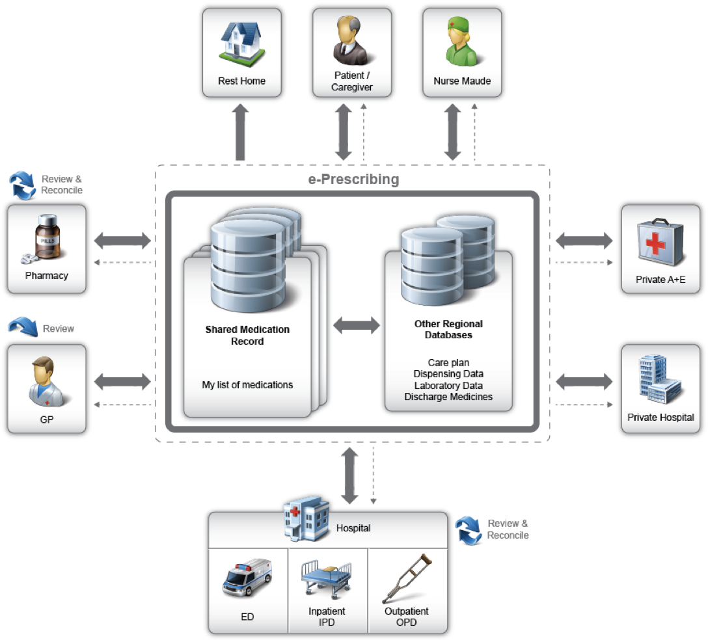

[原文链接:Regional Shared Medications with FHIR](http://fhirblog.com/2013/11/04/regional-shared-medications-with-fhir/)
## Regional Shared Medications with FHIR    区域范围内共享的用药信息
**译者注:用药信息是每个医疗信息标准都迈步过去的坎儿，作者围绕着这个topic的第一篇。这里面主要是介绍一个区域性的居民的用药信息库
,其他的医疗信息系统在对自己系统中患者的用药信息进行操作时,都事先与用药库进行比对同步.
当然围绕着用药库可以做一些面向患者,医生的门户,适合与移动医疗的场景.

[如何使用List来表达患者的用药列表信息](http://fhirblog.com/2013/10/31/representing-a-patients-list-of-medications-in-fhir/)     
[如何使用transaction来对患者用药列表信息进行更新操作](http://fhirblog.com/2013/10/31/representing-a-patients-list-of-medications-in-fhir/)    
[区域范围内该共享哪些用药信息](http://fhirblog.com/2013/11/04/regional-shared-medications-with-fhir/)    
[FHIR Medication lists revisited](http://fhirblog.com/2014/10/13/medication-lists-revisited/)

整体架构图如下


用药信息库旨在让所有的医务人员,患者都能够使用.其中包含大量不同类型的用药信息.比如:
* 现用药列表(FHIR List表示)
* 现用药列表中引用的MedicationPrescription资源
* MedicationDispense资源
### 应用场景
考虑如下:
*  存储药房的药物配送记录 药房每次配药的时候,就生成一个MedicationDispense资源并将数据保存到用药库
*  检索一段时间内某个患者的配药数据.主要是在医师reconciling the patients’ medication list的情况下使用
*   获取患者现用药列表.任何人在患者的诊疗过程中包括患者和护理人员,比如康复中心,全科诊所以及急诊室  
*   获取患者现用药列表的变更记录,和前一个版本的用药列表
*   更新患者的现用药列表

这里面之涉及到用药信息的记录,并没有下医嘱(会用到MedicationPrescription资源)的功能.

### Security安全

系统间的通讯间只能走SSL连接.使用oAUTH来认证和标识用户.简单起见,任何注册用户均可以访问每个患者的记录.后续会考虑一些隐私安全策略-尤其是在更新用药信息的情况.

### FHIR接口

Patient相关接口
仅提供一个已有的注册服务的接口,比如说区域平台或者社交平台的帐号 tx sina之类的
    Find Patient (eg GET /Patient?name=eve)
    Get Patient by identifier (eg GET /Patient?identifier=PRP1660)

Practitioner相关接口
与patient类似.
    Find Practitioner (eg GET /Practitioner?name=smith)
    Get Practitioner by identifier (eg GET /Practitioner?identifier=PRP1660)

MedicationDispense相关接口
从药房获取到数据,然后客户端可以和对这个列表是否正确,也就是reconciling列表的过程,列表中是否包含了患者已经拿到的药
假设药房在提交数据前先查询患者ID,然后将该MedicationDispense数据发送到用药库.因此,需要以下两个接口
    Submit a dispense resource (POST /MedicationDispense)
    Get dispense records in the past (say) month (GET / MedicationDispense?patient={patientID}&whenHandedOver < {1 month ago}
另外,MedicationDispense 和 MedicationPrescription 资源都会调用Medication 资源,其中包含了具体的药品信息,
medication资源有一个字段为code,可以使用某种药典来表示具体的药物. For example in New Zealand we have the ULM (Universal List of Medications) – a terminology based on SNOMED – thus the code 44362701000116107 refers to a 100mg tablet of aspirin

假设客户端根据这个字典来进行查询检索,我们需要code和code system.出于这样的考虑,我们在MedicationDispense 和 MedicationPrescription 资源直接包含Medication资源,而不是间接的引用它.

MedicationPrescription相关接口
MedicationPrescription主要用来记录患者服用的每种药物的详细情况,比方说药物名称,剂量,原因等.在另一篇文章里我们讨论了使用
"transaction"来批量更新药品信息,也就是说我们只需要一个根据资源标识来检索资源数据的接口
    Get a single MedicationPrescription (GET /MedicationPrescription/{ID})

List相关接口

    Get a patients list of medications (GET /Patient/{patientID}/List?code=10160-0)
    Update a patients list of medications. This will be a transaction update as described earlier.
    GET  /List/{listID}/_history
    GET  /List/{listID}/_history/{versionID}

SecurityEvent相关接口
以下情况自动生成审计事件资源
* 当要获取患者的用药列表
* 当要更新患者的用药列表

    Get a bundle of SecurityEvent resources for a patient over a given time period (GET /SecurityEvent?patientId={patientID}&date > {startDate} & date < {endDate}


上面描述了一些接口功能,相较于文档存储的方式,这种方式更有利于信息的查,诸如那些人服用了某种药物,多少人有糖尿病但在过去半年内没有进行HBA1C检查

附件是一个conformance的例子
```
<?xml version="1.0" encoding="utf-8"?>
 <Conformance xmlns="http://hl7.org/fhir">
   <text>
     <status value="generated"/>
     <div xmlns="http://www.w3.org/1999/xhtml">
       <p>This conformance statement supports the Shared Medication repository, and specifies the following endpoints</p>
       <p>Person: Read and Search on name and identifier</p>
       <p>Practitioner: Read and Search on name and identifier</p>
       <p>MedicationDispense. Create, and search on patient,whenHandedOver</p>
       <p>MedicationPrescription. Read. </p>
       <p>List. Create and search on code,patient. Version read.</p>
       <p>SecurityEvent. Search on patient,date</p>
       <p>Transaction interfaces to update the Medication List</p>
     </div>
   </text>

   <identifier value="68D043B5-9ECF-4559-A57A-396E0D452311"/>
   <version value=".1"/>
   <name value="My List Of Medicines (MLOM) Conformance Statement"/>
   <publisher value="Elbonian MOH"/>
   <telecom>
     <system value="email"/>
     <value value="wile@elbonia.govt"/>
   </telecom>
   <description value="The FHIR endpoints required to support a regional Medication repository - My List Of Medicines"/>
   <date value="2012-10-14"/>
   <software>
     <name value="MLOM"/>
     <version value="0.34.76"/>
   </software>
   <fhirVersion value="0.12"/>
   <acceptUnknown value="false"/> <!--   this system does not accepts unknown content in the resources   -->

   <!--   this system can do either xml or json. (Listing both implies full support for either, with interconversion)   -->
   <format value="xml"/>
   <format value="json"/>
   <!-- We only support REST interfaces at this time. This includes transaction to the server root to update the List-->
   <rest>
     <mode value="server"/>

     <!-- SecurityEvent record -->
     <resource>
       <type value="SecurityEvent"/>
       <operation>
         <code value="read"/>
       </operation>
       <searchParam>
         <name value="patient"/>
         <type value="reference"/>
         <documentation value="Lookup by patient."/>
       </searchParam>
       <searchParam>
         <name value="date"/>
         <type value="date"/>
         <documentation value="Lookup by date the event occurred."/>
       </searchParam>
     </resource>

     <!-- MedicationDispense record -->
     <resource>
       <type value="MedicationDispense"/>
       <operation>
         <code value="create"/>
       </operation>
       <operation>
         <code value="read"/>
       </operation>
       <searchParam>
         <name value="patient"/>
         <type value="reference"/>
         <documentation value="Lookup by patient."/>
       </searchParam>
       <searchParam>
         <name value="whenHandedOver"/>
         <type value="date"/>
         <documentation value="Lookup by date the medication was given to the patient."/>
       </searchParam>
     </resource>

     <!-- MedicationPrescription resource. The prescription records are all created through the 'transaction' process so read-only -->
     <resource>
       <type value="MedicationPrescription"/>
       <operation>
         <code value="read"/>
       </operation>
     </resource>

     <!-- List resource. Used to support the List of Medications. -->
     <resource>
       <type value="List"/>
       <operation>
         <code value="create"/>
       </operation>
       <operation>
         <code value="read"/>
       </operation>
       <operation>
         <code value="vread"/>
       </operation>
       <searchParam>
         <name value="patient"/>
         <type value="reference"/>
         <documentation value="Lookup by patient."/>
       </searchParam>
       <searchParam>
         <name value="code"/>
         <type value="token"/>
         <documentation value="Lookup by code - this will be for the MLOM"/>
       </searchParam>
     </resource>

       <!-- The Practitioner resource endpoint -->
       <resource>
         <type value="Practitioner"/>
         <operation>
           <code value="read"/>
         </operation>
         <searchParam>
           <name value="name"/>
           <type value="string"/>
           <documentation value="Lookup by practitioner name. All parts of the name are searched."/>
         </searchParam>
         <searchParam>
           <name value="identifier"/>
           <type value="token"/>
           <documentation value="Lookup by identifier. Both active and inactive practitioners will be returned."/>
         </searchParam>
       </resource>

     <!-- The Patient resource endpoint -->
     <resource>
       <type value="Patient"/>
       <operation>
         <code value="read"/>
       </operation>
       <searchParam>
         <name value="name"/>
         <type value="string"/>
         <documentation value="Lookup by patient name. Only active patients will be returned. All parts of the name are searched."/>
       </searchParam>
       <searchParam>
         <name value="identifier"/>
         <type value="token"/>
         <documentation value="Lookup by identifier. Both active and inactive patients will be returned."/>
       </searchParam>
       <searchParam>
         <name value="birthDate"/>
         <type value="date"/>
         <documentation value="Lookup by patient birts date. Supports the :before and :after modifiers to allow for age ranges"/>
       </searchParam>
     </resource>
   </rest>
 </Conformance>
```


