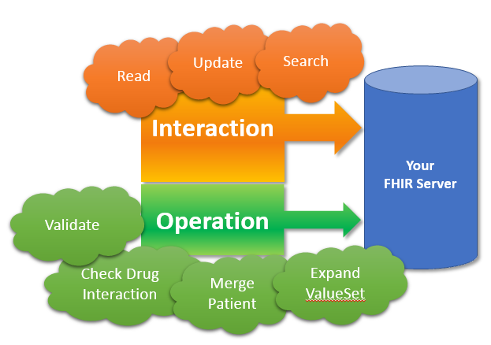

[原文链接：The new DSTU2 Operations framework](http://thefhirplace.com/2015/04/29/the-new-dstu2-operations-framework/)

### **operation 框架** 的诞生

众所周知，你可以使用 **extension** 来对FHIR中核心数据模型进行自由扩展，以满足系统和特殊场景下的数据需求。同时可以在FHIR 服务器上 发布这些扩展定义的详细信息，这样大家就可以找到你所定义的扩展的具体含义和表达的是那类数据。 DSTU2 中 FHIR 引入了另一种扩展机制 **operation 框架**.除了FHIR 中定义好了的REST接口之外，你可以添加额外的操作/接口，这样就可以添加一些 只是针对某个系统的功能。同样的，你也可以将这些operation/操作/接口定义发布到 FHIR服务器中，大家就可以找到你所定义的扩展的具体含义和如何调用这些 operation/操作/接口。

那么到底在FHIR的REST接口中，“operation”具体指的是什么呢？DSTU1中对于这个问题还不明朗，FHIR中只是包括了一些定义好的interaction/接口，诸如read、search、validate等。
另外，DSTU1中有一个叫“_ query”的查询参数，用于表示自定义的查询。 有趣的是，标准中所定义的唯一一个查询是[值集的扩展](http://www.hl7.org/fhir/DSTU1/valueset.html#expansion)，由此引发了 值集扩展到底算不算查询的争论。另外，仍然有必要添加一些有副作用的operation/操作/接口，也要能使用复杂类型的参数。“_ query”的接口不能满足所有这些要求，由此产生了[operation框架](http://www.hl7.org/fhir/2015May/operations.html).

当你调用 FHIR 服务器中的一些方法时，要么调用的是最基本的核心交互，也就是CRUD 操作，查询和变更记录(CRUD operations, search and history)。 要么就是operation/操作/接口。标准中会包括一些预先定义好的operation/操作/接口，当然你也可以自行定义新的operation/操作/接口。 

### **operation** 的调用

Operations大多数是使用POST方法到FHIR endpoint，Operations的名称是以 “$” 号为前缀，比如 ``` POST http://fhir.someserver.org/fhir/Patient/1/$everything ``` 不管operation是不是幂等的，都可以使用GET方法。 可以在四种不同类型的FHIR endpoint中调用 operation ：
* FHIR 服务的根节点：(e.g. http://fhir.someserver.org/fhir) ，这些operation是在整个服务器层面上执行的。比如：返回服务器中已知的所有扩展
* 某个资源类型的节点：(e.g. http://fhir.someserver.org/fhir/Patient)，这些operation是在所有该类型的资源实例层面上执行的
* 某个类型的某个资源实例的节点：(e.g. http://fhir.someserver.org/fhir/Patient/1) 这些operation是在该类型的某个资源实例层面上执行的，比如上例中的$everything operation
* 某个类型的某个资源实例的某个版本的节点： (http://fhir.someserver.org/fhir/Patient/1/_history/4)。这些operation是在某个类型的某个资源实例的某个版本层面上执行的，要注意的是，这些操作不应该改变实例的数据，主要是为了管理profile 和tag等元数据。

调用请求的body中包含了一个特殊的资源[parameters](http://www.hl7.org/fhir/2015May/parameters.html)，该资源是一些键值对的集合， 其中的值可以是任意的基本数据类型或是复杂数据类型，亦或是完整的某个资源。除此之外，还可以使用格式化成查询参数类型的字符串。 调用完成之后，operation 返回另一个 Parameters 资源。其中包含一到多个输出 Parameters资源。也就是说 FHIR operation 可以接收任意输入，返回一些输出参数。 由于引入了 Parameters 资源， 这样POST请求的body和返回的结果总是一个资源。如果没有这种机制，我们需要对FHIR 接口和 FHIR的序列化格式进行扩展来满足那些body中包含复杂数据类型的情况。

### **operation** 定义的发布

了解了如何调用之后，我们来看看如何发现新的 operations 。这里要用到[OperationDefinition resource](http://www.hl7.org/fhir/2015May/operationdefinition.html),与extension一样，它是一种对 operation 定义结构化的表达方式，包含了一些元数据和输入输出值参数的详细信息。由于 OperationDefinition 本身也是一种资源，可以在FHIR 服务器或FHIR仓库中进行发布。 开发工具可以利用该定义，生成API 接口，如[我们的发布工具生成的这样](http://www.hl7.org/fhir/2015May/operation-valueset-expand.html) ，亦可以利用它来生成相关的文档。

DSTU2中包含了一些[预先定义好的 operations](http://www.hl7.org/fhir/2015May/operations.html#2.2.0.1)，在DSTU1中的一些interaction，在DSTU2中被作为operations：

* Validation ($validate) –取代了DSTU1中的 _ validate interaction。可以根据资源内容You can send in a Resource (or a reference to a resource) and a reference to a StructureDefinition to get your resource validated.

* Tag operations ($meta, $meta-add, $meta-delete) – 取代了DSTU1中的[tag operations](http://hl7.org/fhir/DSTU1/http.html#tags),用于给某个资源实例添加 profile, tag and security tag metadata 。

* Mailbox endpoint ($mailbox) – Delivers a message to a FHIR server. 除此之外，spec中现在定义了完整的ValueSet operation，这样子FHIR 服务器就相当于[术语服务器](http://www.hl7.org/fhir/2015May/terminology-service.html),能够提供一些CTS的功能。

每类资源介绍的"operation"标签下面包括了定义好的所有operation。
