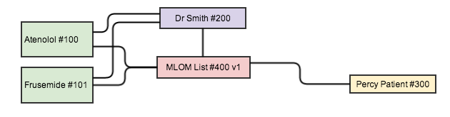
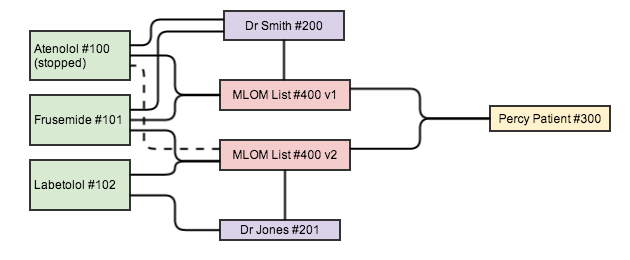

[原文链接:Updating the Medication List ](http://fhirblog.com/2013/11/01/updating-the-medication-list/)
## Updating the Medication List    如何更新用药列表信息
**译者注:用药信息是每个医疗信息标准都迈步过去的坎儿，作者围绕着这个topic的第二篇。在知道了如何用List资源来表示患者的用药列表之后,这里主要探讨如何对列表中的信息进行更新操作.比方说,医师调整了患者正在服用的药物,想要记录这些变更.

[如何使用List来表达患者的用药列表信息](http://fhirblog.com/2013/10/31/representing-a-patients-list-of-medications-in-fhir/)
[如何使用transaction来对患者用药列表信息进行更新操作](http://fhirblog.com/2013/10/31/representing-a-patients-list-of-medications-in-fhir/)
[区域范围内该共享哪些用药信息](http://fhirblog.com/2013/11/04/regional-shared-medications-with-fhir/)
[FHIR Medication lists revisited](http://fhirblog.com/2014/10/13/medication-lists-revisited/)

List资源用来表示其他资源的集合,其中可能会包含大量的存储于其他地方的资源数据.

以患者正在服用2种药物的简单场景为例:
* 一个Practitioner资源 ,下达医嘱的药师和用药列表的作者/来源
* 一个Patient资源
* 2个MedicationPrescription资源,分别描述药物信息
* 一个List资源引用了上述资源

资源间的线表示资源引用.
如果Atenolol停用之后,用Labetolol替换,又会如下

注意:
* 这样List资源就产生了一个新版本 ID相同
* 新版本的List的医生是Dr Jone
* 一般而言,下医嘱的和List作者是同一个人,但不异地给你是
* 新版本的List保留了对Atenolol的引用,事实上是不必要的,但这样做能够表示在开始服用Labetolol的时候停用了Atenolol(及其原因)

假设我们拿到了患者ID,可以通过如下流程来实现
1. 获取已有的用药列表GET /Patient/100/List?code=http://loinc.org|10160-0 which is a FHIR query that will return a bundle containing the List
2. 获取我们要停用的medicationPrescription GET操作,将其status字段值设为'nullified',执行PUT更新操作.
3. 新增一个MedicationPrescription资源,Post新增
4. 在List资源中对应的要停用药物的entry中 flag字段设为‘cancelled’,deleted字段设为true,可以添加一个extension来表示停药的原因
5. 在List为新增的药物添加一个entry
6. 对新的List数据进行PUT操作 获得新版本的List

这个流程整体来看并不复杂,但是后面的步骤是以前面的步骤为前提的,要么都成功,要么都失败,这实际上就是数据库操作中的transaction的概念

一种方式是
* 客户端按照上述流程依次操作,和对每一步是否成功,是否需要在过程中进行回滚操作,是否同时有其他客户端对同样的数据进行更新操作
* 在客户端生成或更新所有资源数据,将所有资源打包成一个bundle,通过transaction请求发送到服务器上,服务器负责保证整个操作是否成功失败

目前FHIR DSTU1中bundle是Atom feed格式的,可以是XML或JSON.每个entry表示一个FHIR资源.
Entry.id表示的是资源的逻辑ID,非特定版本相关的ID,每个资源都只有一个逻辑ID
Entry.link表示的特定版本相关的ID,可选字段,但在针对版本的更新中能够避免不不要的冲突
使用Bundle之后的流程如下:
1. 生成新的Bundle,
2. 获取已经存在的用药列表 拿到List的ID值
2. 获取我们要停用的medicationPrescription GET操作,将其status字段值设为'nullified',将变更后的资源添加至bundle当中,将entry.id值设为
medicationPrescription的ID.
3. 新增一个MedicationPrescription资源,添加到bundle当中,使用CID scheme的方式分配一个临时值到entry.id字段中
4. 在List资源中对应的要停用药物的entry中 flag字段设为‘cancelled’,deleted字段设为true,可以添加一个extension来表示停药的原因
5. 在List资源中新增一条List.entry来保存对新增药物的引用,ID使用3中的临时值
6. 将更新后的List资源添加至bundle当中,entry.id设为List的ID
7. 通过Post操作提交bundle到服务器上

最后提交的bundle中包含
*   2 MedicationPrescription resources (1 new & 1 updated) and
*   1 List resource

服务器拿到bundle之后,处理过程和单独提交时的操作一致,返回成功或失败的结果.服务器也可以自行实现其他的一些业务处理逻辑或校验逻辑
比如,核对bundle中List资源的版本和服务器上最新的版本一致.

对于客户端而言,这种方式简化了工作量,将复杂度抛给了服务端.
