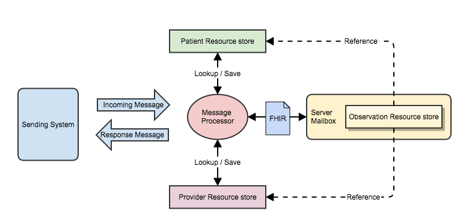

[原文链接:FHIR Messages – part2](http://fhirblog.com/2014/10/06/fhir-messages-part-2/)
## FHIR Messages – part 2    FHIR 消息：第二篇——V2 消息与 FHIR 消息的工作流程和架构

**译者注:消息是医疗信息交换的一种重要模式，从HL7 V2 V3到X12等。对于已经应用了HL7 V2 消息的系统来讲，如何迁移到 FHIR 消息中来，是我们接下来要探讨的话题.
由于原文是2014年10 06日撰写的，但是FHIR Dstu在过去的日子里发生了较大的变化，所以我根据最新的版本对原文中的一些内容进行了修正。**

### 整体流程说明

在第一篇里面我们给了一个简答 的例子，演示了 V2 消息和FHIR 消息的字段间的具体映射关系，这篇里着重探讨一下工作流程和架构相关的一些内容。

本文中仍然沿用第一篇中的放射学报告的例子来进行说明.

[FHIR 消息架构](http://hl7-fhir.github.io/messaging.html)中介绍了消息架构的前提条件和消息交换的模式，这里不在赘述。

简易的架构图如下所示:

 
消息处理器接受源系统发送的V2消息，将其转换成FHIR消息提交至 ‘Mailbox’服务器节点，该服务器节点处理之后将反馈给消息处理器一个FHIR 消息，消息处理器紧接着将该FHIR 消息转换成 V2消息反馈给源系统。整个架构中我们认为系统间的通信是异步的，但mailbox服务器内部的处理是同步的。

“Server Mailbox” 也就是实际上存储 Observation 的服务器。接口‘mailbox’负责处理消息。
图中 Patient and Provider的存储是与“Server Mailbox” 分离的，但实际上可能是同一个。

假设Message Processor 到 mailbox 服务器间是同步的 HTTP 请求，整体流程总结如下：

* RIS系统生成一条v2 消息将其发送给消息处理器.
* 消息处理器根据映射关系生成FHIR 消息，转至‘Mailbox’服务器节点。要给bundle and MessageHeader分配ID（MessageHeader.identifier表示的是业务层面上该消息的标识符，而bundle ID 指的就是这一条消息 这个bundle资源自身的标识）
* ‘Mailbox’服务器节点根据MessageHeader.event code的值识别出具体的消息类型，完成预设的处理。这里也就是完成数据存储。
* 在处理完成之后，‘Mailbox’服务器节点新建一个反馈消息，也就是新建一个bundle(分配唯一的bundle.id)，其中包含了另一个MessageHeader，MessageHeader中包含了服务器节点的信息也有自己的标识符，其中response元素的值表示它是哪条消息的响应消息(类似于V2中的 ACK消息)。并将反馈消息发送给消息处理器。response元素包含如下元素:
	* an identifier – 也就是请求消息的MessageHeader.identifier。该字段在同步模式下不是必要的，异步模式则是必须存在。
	* a code 表示处理的结果
	* a details是一个OperationOutcome资源，表示错误的具体信息
* 消息处理器收到反馈消息后，根据它构建一条HL7 V2 ACK消息
* 消息处理器将ACK消息反馈给RIS系统.

 HTTP 状态码反映了处理的结果。

#### 架构方面的考虑因素

* Patient & Provider 在哪里存储? 如果和Observation没有存在同一个服务器上，就需要消息处理器负责构建新的Patient & Provider 资源(‘Mailbox’服务器节点能够做的话就另说了)。
* 消息处理器与‘Mailbox’服务器节点如何通信？可以是同步，或者异步。如果是异步的话， MessageHeader.response.identifier字段必须赋值。
* 消息处理器如何管理错误，比如消息映射过程中或者是'Mailbox’服务器节点返回的处理错误

#### Server  Mailbox 方面的考虑因素

* ‘Mailbox’服务器节点是本地存储 Observation还是存储到其他服务器上
* 如果Patient & Provider resources是存储在‘Mailbox’服务器节点本地的，‘Mailbox’服务器能够新建资源，处理好引用。
* 如果Patient & Provider resources是存储在其他服务器上，‘Mailbox’服务器能够进行查询并在外部服务器上新建资源。
* 处理存储数据之外，‘Mailbox’服务器是否还要完成其他处理，比如有新的待评审结果时发送通知
* 在返回的bundle中‘Mailbox’服务器是否应包含已更新的Observation数据。

#### 策略方面的问题

* Patient & Provider资源的标识符查询的命名空间是什么？加入V2消息中没有命名空间的话，是否应假设它们就是存储在本地的
* Patient & Provider如果在本地存储中没有找到该如何处理？到底是报错还是新建，如果是报错的话，该如何管理？
* 如果多个Patient & Provider拥有同样的标识该如何处理？是报错还是择其一使用？

#### 消息转换方面的问题

* 消息中source and destination endpoints到底应该是什么，第一篇中我们只是简单的认为消息处理器是发送方，‘Mailbox’服务器是接收方。假如‘Mailbox’服务器能够直接接收其他系统的发送的消息呢？
* responsible字段该如何赋值？尤其是医嘱和医嘱响应中该怎么使用

### 总结

