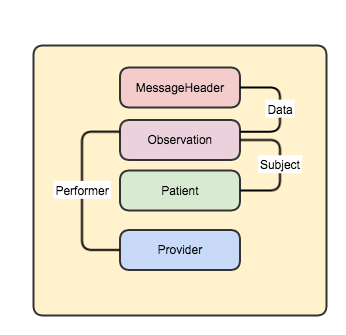

[原文链接:Mapping HL7 Version 2 to FHIR Messages](http://fhirblog.com/2014/10/05/mapping-hl7-version-2-to-fhir-messages//)
## Mapping HL7 Version 2 to FHIR Messages    FHIR 消息：第一篇——V2 消息与 FHIR 消息的映射
**译者注:消息是医疗信息交换的一种重要模式，从HL7 V2 V3到X12等。对于已经应用了HL7 V2 消息的系统来讲，如何迁移到 FHIR 消息中来，是我们接下来要探讨的话题.
由于原文是2014年10 05日撰写的，但是FHIR Dstu在过去的日子里发生了较大的变化，所以我根据最新的版本对原文中的一些内容进行了修正。
全文以ORU^R01消息为例，简述了该V2 消息应该包含哪些字段，字段的含义，如果用FHIR 消息表示该V2消息又要使用到哪些FHIR 资源，资源的字段又如何赋值。**


### HL7 V2消息和FHIR 消息说明
为了简便起见，这里我们使用 HL7 V2.4 中的ORU^R01消息作为案例，利用它得到一个FHIR 消息， 然后将该消息提交到 FHIR 服务器中，最后将实际的数据存储到一个 Observation里去。

实际的应用中可能会存在多个 OBX 区段segment，每个 OBX 区段里都包含了单独的观察结果，每个OBX 区段都可以表示成消息中的一个Observation。我们也忽略了一些区段，这里只展示我们的数据会用到的一些区段。假如要能够实现双向的转换，也就是说要能够从 FHIR 消息转换成 V2 消息的话，我们可能需要更多的数据，甚至要用到一些扩展。这里的案例中只考虑根据一个 Radiology observation和与之相关的内容来创建一个 FHIR 消息。

如下就是一个 HL7 V2 消息的范例
```
MSH|^~\&|Amalga HIS|BUM|New Tester|MS|20111121103141||ORU^R01|2847970-201111211031|P|2.4|||AL|NE|764|ASCII|||
PID||100005056|100005056||Dasher^Mary^""^^""|""|19810813000000|F||CA|Street 1^""^""^""^34000^SGP^^""~""^""^""^""^Danling Street 5th^THA^^""||326-2275^PRN^PH^^66^675~476-5059^ORN^CP^^66^359~-000-9999^ORN^FX^^66^222~^NET^X.400^a@a.a~^NET^X.400^dummy@hotmail.com|123456789^WPN^PH^^66|UNK|S|BUD||BP000111899|D99999^""||CA|Bangkok|||THA||THA|""|N
PV1||OPD   ||||""^""^""||||CNSLT|||||C|VIP|||6262618|PB1||||||||||||||||||||||||20101208134638
PV2|||^Unknown|""^""||||""|""|0||""|||||||||||||||||||||||||||||HP1
ORC|NW|""|BMC1102771601|""|CM||^^^^^""|||||||||""^""^^^""
OBR|1|""|BMC1102771601|""^Brain (CT)||20111028124215||||||||||||||||||CTSCAN|F||^^^^^ROUTINE|||""||||||""|||||||||||^""
OBX|1|FT|""^Brain (CT)||++++ text of report goes here +++|||REQAT|||F|||20111121103040||75929^Gosselin^Angelina
````

其中包含了7个区段：

| 区段名称 | 用途 | 对应的FHIR 资源 |
| ---- | ---- | ---- |
| MSH | 消息头 消息的元数据 | MessageHeader |
| PID | 患者的身份标识 | Patient |
| PV1 | 就诊信息 | 该案例中未使用到 |
| PV2 | 就诊的额外信息 | 该案例中未使用到 |
| ORC | 医嘱信息 | 该案例中未使用到 |
| OBR | 观察的申请 | Observation |
| OBX | Observation观察项的值 | Observation.performer |

而对应的 FHIR 消息结果大体如下所示


其中包含了如下的资源
* MessageHeader
* Observation
* Patient (Subject of the Observation)
* Provider (Performer of the Observation)

有了上面的知识之后，我们看一下如何根据 V2 消息中的数据来得到这样一些对应的资源。

### 如何生成 FHIR 消息

#### Bundle

在以前的版本中 Bundle 是遵循atom feed标准的，但最新的版本中已经将其结构调整为 FHIR 自定义的一个资源。
> FHIR 中， Bundle.type=message， Bundle.entry.resource[1]=MessageHeader。每个消息包含2个标识符，第一个Bundle.id指的是表示这个消息的资源的标识，而第二个MessageHeader.identifier指的是消息自身的标识,这个标识最好使用OID或者是UUID，保证它是全球唯一的。而Bundle.id则随消息的发送而变化，也就是说同一条消息的内容，第一次发送和第二次发送Bundle.id是不同的。

#### MessageHeader

在表示 FHIR 消息的 Bundle 里， MessageHeader 是Bundle.entry.resource的第一个资源，MSH 区段 与 MessageHeader 字段间的映射关系如下

| 字段名称 | V2 区段名称 |  描述 |
| ---- | ---- | ---- |
| MessageHeader.Identifier | MSH-10 | 消息自身的标识符 |
| MessageHeader.Timestamp | MSH-7 | 消息的发送时间 |
| MessageHeader.Event | MSH-9.2 | 消息的类型 详细取值请参考http://hl7.org/fhir/message-events |
| MessageHeader.Source.name | MSH-3 | 发送消息的系统名称 |
| MessageHeader.Source.software | MSH-3  | 发送消息的系统、软件名称 |
| MessageHeader.Source.endpoint | MSH-24 | 发送系统的网络IP |
| MessageHeader.Destination.name | MSH-5 | 接收系统的名称 |
| MessageHeader.Destination.endpoint | MSH-5 | 接收系统的名称 |
| MessageHeader.data |   | References to the ‘root’ resource of the message. |


* MessageHeader.Identifier是由发送系统设置的，应该在发送系统的范围内是唯一的，理论上应该是全球唯一的，但对于V2来说是没有办法保证这点的。
* MessageHeader.Source.software字段值建议使用SFT区段，但该区段只有在V2.5以后的版本中才存在，这里就直接用了source.name
* MessageHeader.Event这里我们使用 observation-provide ，如果在 FHIR 定义的消息类型中找不到合适的，我们也可以使用V2的消息类型
* enterer, author and receiver中可以表示消息是由谁生成的，发送给谁的，如果有数据的话就可以赋值。
* MessageHeader.data是对具体的 Observation 的引用，如果我们有多个 Observation的话，我们可能要用到一个List来组合这些Observation。


#### Observation

Observation 中包含了放射检查结果的数据。


| 字段名称 | V2 区段名称 |  描述 |
| ---- | ---- | ---- |
| Observation.code | OBX-3 | 观察项的类型 |
| Observation.valueString | OBX-5 | 观察项的值 |
| Observation.interpretation | OBX-8| 对观察项的值的解释 高、低、正常等 |
| Observation.comments | NTE-3 | 对观察值的评论、批注 |
| Observation.appliesDateTime | OBX-14 | The time or time-period the observed value is asserted as being true. |
| Observation.issued | OBR.22 | 观察的日期时间 |
| Observation.status | OBX-11| 观察项的状态 到底是临时报告还是最终报告 到底是审核和终止 |
| Observation.reliability |OBR-25 | 质量问题对观察值的影响程度的估计  |
| Observation.identifier | OBX-21 | 观察项的标识 |
| Observation.subject |   | 观察的对象 人、物件、地理位置 |
| Observation.performer |   | 观察的执行者. |

* OBX-3中保存的是观察项的名称 类型 数据类型为CE，
* Observation.value[x]中表示的观察项的具体值，在V2 中，我们要考虑下面三个部分：
	* OBX-2 中是观察项的类型，对于放射学检查结果，可能是FT或者ST区段，Observation.value[x]可采用string类型.具体数据类型的选择要根据OBX-2来确定。
	* OBX-5 中是观察项的具体值。
	* OBX-6是观察项值的单位。
* 我们使用 OBR-22 中的数据来表示报告的发布日期时间
* OBX-8 (Abnormal Flags) and OBX-9 (Probability) 所表示的数据均是说结果是期望的范围之内，而非结果是否可信。这里使用OBR-25 (Result Status) 中的数据来给Observation.reliability赋值
* V2中如果要对OBX 中的结果进行批注，需要在OBX后面紧跟一个 NTE区段来表示。
* Observation.text的值可以从OBX-2中拿到，但具体的处理暂不讨论，

#### Patient

FHIR 中 Patient 用一个单独的资源来表示，甚至可能与 Observation 都不在同一个服务器上, 在Observation 中要引用 这个 Patient 资源，那么首先要找到Patient 的url。如果找不到的话我们要新建一个 Patient 资源。

首先根据 PID 区段中的值在服务器中进行查找，PID 区段中的患者标识都是 CX 数据类型的，与FHIRs 中 identifier数据类型是等同的。如果服务器中能够找到对应的记录，直接引用该URL即可，如果找不到的话就使用 PID 区段中的值新建一个患者资源。

查询患者资源的请求如下所示:
````
GET [patientserver]/patient?identifier={identifier}
````

* 如果正好找到一条记录， Observation.subject引用即可。
* 如果找到不止一条记录，我们认为存在错误并拒绝该消息或者进行认为干预，视具体情况来定
* 如果找不到一条记录，我们要先排除 Patient 和Observation 是不是在同一个服务器上
	* 如果在同一个服务器上且找不到记录，直接使用PID 区段中的值新建一个患者资源，这时候要给patient分配一个格式如 cid: prefix的标识
	* 如果不在同一个服务器上且找不到记录，我们新增一条记录，保存到服务器上并获取ID。用返回的ID构建新的patient 资源替换消息中的内容即可
我们也可以使用transaction机制来将内部检索隐藏到服务器上去。


#### Provider

observation 有一个performer字段用于记录完成、执行观察的设备、人。我们的案例中Provider是一个设备。

与Patient 中很类似，我们要找到这个具体的资源，然后引用即可。但有一些额外的考虑因素：

* performer 的数据可能存在于 V2 消息的多个地方，具体得视 V2 的消息类型来定
* 根据我们选择的情况，可能会出现信息不足以构建一个新的资源的情况出现。

在我们的案例中，选择 OBX-16-responsible observer.该字段的数据类型为XCN (Extended Composite ID Number and Name for Persons) –也就是说如果要新建资源的话数据是足够的。


### 总结

V2 具体实现的差异可能会使得 V2 消息 到FHIR 消息的转换异常困难，具体情况还是得具体分析


