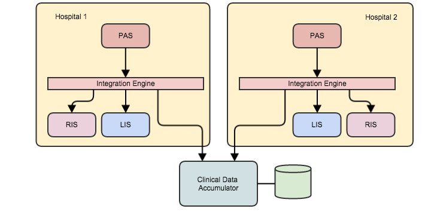
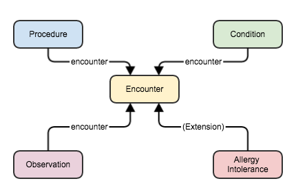

[原文链接:More FHIR Messaging: ADT messages](http://fhirblog.com/2015/03/18/more-fhir-messaging-adt-messages/)
[原文链接:FHIR Messaging: Clinical data from ADT Messagess](http://fhirblog.com/2015/03/23/fhir-messaging-clinical-data-from-adt-messages//)

## More FHIR Messaging: ADT messages    FHIR 消息：第三篇——不同类型的V2消息所对应的FHIR 消息中涉及的资源

**译者注:消息是医疗信息交换的一种重要模式，从HL7 V2 V3到X12等。对于已经应用了HL7 V2 消息的系统来讲，如何迁移到 FHIR 消息中来，是我们接下来要探讨的话题。
本来是两篇，我们这里整合成一个.一开始给出了患者管理域ADT消息的常见字段，随后分析了系统在收到不同的ADT消息该做出哪些处理(增删改哪些FHIR资源)**

###

V2 消息始于1987年，其中定义了一些触发事件，以及这些触发事件所引起的消息，规定了在收到消息之后应该完成的一些特殊的行为。

比如患者入院是其中一个常见的，患者的详细信息通过Patient Administration System (PAS)(门诊住院医生工作站、挂号系统)录入，遂即产生一条 V2 消息发送至每个订阅系统-诸如RIS和LIS系统。

触发事件的编码为 ‘A01’, 消息类型为 ‘ADT’ (Admission/Discharge/Transfer) – 也就是俗称的 ADT^A01 消息

一旦接收系统处理完消息之后，消息自身就没用了，可以丢弃，但大多数系统都保留一份用作审计。与CDA不同，它不是用于持久化的临床文档，与REST不同，它没有明确定义系统的处理行为(GET 读 POST 新增)。

V2标准应用很广泛，这里只拿一小部分来看看如何使用 FHIR 来实现 V2 消息.

FHIR messaging 框架不像 REST接口那样成熟，这里我们要先做一些预设，后续的FHIR 中可能会发生变更。具体实现的时候请参考最新的 FHIR spec即可。

我们以患者管理域为例– 也就是‘ADT’ (Admission/Discharge/Transfer) 消息。我们要建一个库，其中包含了医生想要查看的从V2 消息中抽取而成的 FHIR resources.
先看一下我们到底需要抽取哪些资源.

第一条消息ADT^A01,也就是入院通知消息。通常是由门诊住院医生工作站、挂号系统产生的，包含大量的区段，大部分都是可选的区段。下表罗列了一些我们要用到的(不是全集),和我们可以从这些数据得到的 FHIR 资源。

| 区段名称 | 资源名称 |  讨论意见 |
| ---- | ---- | ---- |
| MSH | MessageHeader | 包含了发送和接收系统，事件类型，标识符和日期等 |
| PID | Patient | 是哪个患者的消息 |
| PD1 | Patient | 患者的额外信息 |
| PV1 | Encounter | 就诊信息 |
| PV2 | Encounter | 就诊信息的详细信息 |
| OBX | Observation |  |
| PR1 | Procedure | 入院通知是面向管理的而非临床，这里假设这个手术指的是是入院的原因 ，计划中的手术 不能简单的就认为患者已经做了该手术 |
| AL1 | AllergyIntolerance | 过敏史 主要是入院时 患者自己陈述的 |
| DG1 | Condition | 诊断 入院原因 |
| DRG | Condition | 病情的额外信息 |

这样我们就知道了我们的库里应该保存哪些资源的数据。后续几篇文章中将详细讨论每个资源。

由于V2 是表示现实世界中事件的消息标准，从消息到资源的转换并非那么简单直接，我们要考虑工作流程，不同类型的消息将如何影响资源。

常见的模式就是下游的诸如RIS LIS系统订阅医生工作站的入院消息。如果是多院区之间的话，又该如何处理？

我们可以从这些消息生成如下资源：

* Encounters (既往就诊信息，是否住过院)
* Conditions – 就诊时的诊断. 不是正式的problem list
* Allergies –可能不如临床类消息中的过敏信息可靠，但也是很有用的
* Procedures – well, you would expect a hospital to know what procedures they are performing.
* Observations. Not quite sure what these represent in the context of an ADT message, but let’s store them.

在消息模式中，我们需要考虑下面的问题：

* 如何将同一个患者的消息关联起来
* 不同的消息类型对数据模型的影响

数据模型的草图如下：

其中每个临床类资源都与某次就诊相关联，这样才能将工作流问题引起的变更管理起来。

大多数资源中都有这样一个属性：

* Condition: Encounter when condition first asserted. 将Condition.category 设为‘diagnosis’, and 给每次就诊新增一个Condition (as the diagnosis is about that visit).
* Observation: 观察所对应的医疗事件
* Procedure: The encounter when the procedure was performed
* AllergyIntolerance: 这是一个扩展,没有现成的对reference的引用，that there should ‘encounter first asserted’ property – if you feel strongly about it, then raise a change request on the spec – we’ll just use an extension.

这里我们并没有提到 Patient，每个资源都要引用Patient。

这样 模型就有了，来看一下每个消息对我们数据模型的影响

V2.4 中有不止60个消息需要考虑，我们只选其中一些来进行说明。
下表罗列了一些消息以及对数据模型的影响。简便起见用A01来代表ADT^A01

| 消息每次 | 目的 |  是否有临床数据 |  描述 |
| ---- | ---- | ---- | ---- |
| A01 | Admit/Visit Notification | yes | 入院、分配病床后产生的消息。收到该消息后，根据临床数据产生一个新的 Encounter resource |
| A02 | Transfer a Patient | No | 转科转院消息。更新encounter resource，不更新临床数据。值得注意的是如果有临床数据发生变化，应该使用A08消息 |
| A03 | Discharge/End Visit | some | 出院产生的消息。收到该消息后更新 Encounter resource，可能包括手术和诊断洗洗脑，如果要更新相关临床数据，应该使用A08消息 |
| A04 | Register Patient |yes| 与A01类似，这条消息只是指患者目前在医院而非正式入院。收到该消息后，产生一个新的 Encounter resource |
| A05 | Pre-Admit a Patient | yes | 产生一个新的 Encounter resource。在实际入院之前，患者处于检查阶段 |
| A06 | Change an Outpatient to an Inpatient | yes | 门诊病人办理住院时使用。可以更新现有的Encounter resource，或是创建一个新的Encounter resource这里面涉及到如何区分一个Encounter resource，视具体情况来定 |
| A07 | Change an Inpatient to an Outpatient | yes | 住院病人转成门诊病人。要看系统怎么处理了，是不是当成出院来对待，那样的话就要么是 更新现有的Encounter resource，或是创建一个新的Encounter|
| A08 | Update Patient Information | yes | 更新患者的信息。 encounter resource不受影响，其他临床类资源可能会影响（过敏） |
| A11 | Cancel Admit / Cancel Visit Notification | no | 因为某种原因取消了入院通知。根据情况来设置encounter的状态，但临床类数据如何处理？待定 |
| A12 | Cancel Transfer | no | 更新Encounter的状态。临床类数据不变 |
| A13 | Cancel Discharge / Cancel End Visit | yes | 更新Encounter的状态 |
| A28 | Add Person or Patient Information | yes | 与A08类似，主要是用于更新跨患者主数据库的汉子信息。Encounter 不变，临床类可能变 |
| A31 | Update Person Information | yes | 主要是用于更新EMPI中的患者信息 |
| A37 | Unlink Patient Information | no | 参考A40 |
| A38 | Cancel Pre-admit | no | 与A11类似 |
| A40 | Merge Patient – Patient Identifier List | no | 合并两个患者信息(要么是2个关联起来，要么是新的替换掉旧的)。 |
| A45 | Move Visit Information | no | Encounter.subject 的对象变了，至于说患者的标识本身的问题很含糊 是否需要把所有涉及到原来的患者标识的临床类数据的subject都改过来呢？ |
| A50 | Change Visit Number | ---- | This actually changes the visit number – the identifier that indicates that a sequence of messages is about the same visit. The actual effect for us will simply be to update the encounter |

下面的几条要格外注意，不同的医院情况可能各异：

* 如何区分一次“visit”?-比方说接收到一条消息，到底这条消息会影响那个 Encoounter？
* 哪个消息会新建一个 Encoounter 那个会更新现有的 Encoounter
* 患者与 visit 如何关联？ 患者账号 和患者标识如何关联？
* 当 A45 中 Encoounter的患者标识变化时，对应的临床数据如何处理？
* 当一些消息中包含了临床类数据时，我们如何处理单次visit内临床类数据的更新？
	* 是假设每个消息的数据都是完整的还是它们只是待更新的？假如A01中又一个特殊诊断A02没有，我们是不是要移除掉？
	* 如果A02中包含了A01中没有的特殊诊断，是不是要添到列表里面去？
	* 是不是要从A01中生成临床类数据，要求系统在临床类数据变化时发送A08或A28消息？

我们这里做如下假设：

* PV1-19 中包含了就诊的标识号，这样就能知道消息到底属于哪次就诊。使用MSH-4 (sending facility) and MSH-3 (sending application)来区分不同医院 不同系统发送的消息
* PID-3 中包含了所有的患者标识符
* 使用 A01, A04 or A05 来创建临床类数据，使用A08 or A28 来更新此类数据，更新是一个快照操作，也就是说会替换该次就诊中原有的数据
* 支持一个患者有多个标识符，在接收数据时保证标识符和数据一致。在读取数据时处理多个标识符的问题。比如查询使用某个标识符的相关数据，使用EMPI来管理所有标识，然后返回所有匹配的数据
* 如果患者信息是由于A45而发生了改变，我们认为后面会有一条A08消息负责更新临床类信息。这个消息将会改变所有资源的subject。
* 能够接收对于乱序的消息，使用message time (MSH-7) 来决定如何处理这些消息。比如，收到一个出院消息A03，将 encounter.status 设为 ‘finished’，然后收到一条换床消息A02，具体操作将取决于相应的日期时间，如果日期在出院日期之后，则将 encounter.status 设为‘in-progress’，其他情况则忽略该A02消息。

实际上，我们要保证源系统也遵循这样的约定。如果它们不遵循的话，要么改造我们的系统，要么使用一个集成引擎来特殊处理这些不遵循约定的消息。
 For example, if a particular hospital does not emit A08, but does include a snapshot of clinical data in all update messages (like an A02) then the Integration Engine could create an additional A08.

下表则是我们的系统能够支持的消息列表和对应的处理：

<table border="1" cellpadding="0" cellspacing="0" width="431">
<tbody>
<tr valign="top">
<td><strong>Message</strong></td>
<td><strong>Purpose</strong></td>
<td><strong>Action in our system</strong></td>
</tr>
<tr valign="top">
<td>A01</td>
<td>Admit/Visit Notification</td>
<td>Create a new encounter and all related clinical data</td>
</tr>
<tr valign="top">
<td>A02</td>
<td>Transfer a Patient</td>
<td>Update the Encounter properties</td>
</tr>
<tr valign="top">
<td>A03</td>
<td>Discharge/End Visit</td>
<td>Update the Encounter properties</td>
</tr>
<tr valign="top">
<td>A04</td>
<td>Register Patient</td>
<td>Create a new encounter and all related clinical data</td>
</tr>
<tr valign="top">
<td>A05</td>
<td>Pre-Admit a Patient</td>
<td>Create a new encounter and all related clinical data</td>
</tr>
<tr valign="top">
<td>A06</td>
<td>Change an Outpatient to an Inpatient</td>
<td>Update the Encounter properties</td>
</tr>
<tr valign="top">
<td>A07</td>
<td>Change an Inpatient to an Outpatient</td>
<td>Update the Encounter properties</td>
</tr>
<tr valign="top">
<td>A08</td>
<td>Update Patient Information</td>
<td>Update the clinical data associated with this encounter. Note that this can change the subject associated with those resources as well.</td>
</tr>
<tr valign="top">
<td>A11</td>
<td>Cancel Admit / Cancel Visit Notification</td>
<td>Update the Encounter properties</td>
</tr>
<tr valign="top">
<td>A12</td>
<td>Cancel Transfer</td>
<td>Update the Encounter properties</td>
</tr>
<tr valign="top">
<td>A13</td>
<td>Cancel Discharge / Cancel End Visit</td>
<td>Update the Encounter properties</td>
</tr>
<tr valign="top">
<td>A28</td>
<td>Add Person or Patient Information</td>
<td>Update the clinical data associated with this encounter</td>
</tr>
<tr valign="top">
<td>A31</td>
<td>Update Person Information</td>
<td>Not quite sure about this one yet. It’s not really related to a particular encounter, so we’ll think about it a bit more when we start to consume other messages. For now, we’ll ignore it.</td>
</tr>
<tr valign="top">
<td>A37</td>
<td>Unlink Patient Information</td>
<td>Our patient identity system will no longer assume that these two identifiers refer to the same person.</td>
</tr>
<tr valign="top">
<td>A38</td>
<td>Cancel Pre-admit</td>
<td>Update the Encounter properties</td>
</tr>
<tr valign="top">
<td>A40</td>
<td>Merge Patient – Patient Identifier List</td>
<td>Mark the two identifiers as being the same person. (The message contains the ‘surviving’ identifier). We won’t actually merge them – we’ll just link them together. That way we can ‘unmerge’ – A37 – them later.</td>
</tr>
<tr valign="top">
<td>A45</td>
<td>Move Visit Information</td>
<td>Change the encounter.subject to reference the new patient identity</td>
</tr>
<tr valign="top">
<td>A50</td>
<td>Change Visit Number</td>
<td>Change the encounter.identifier property. Of course, an encounter may have multiple identifiers so we’ll need to make sure to change the correct one!</td>
</tr>
</tbody>
</table>

简短的两篇文章希望解释了为什么工作流程是很重要的。

