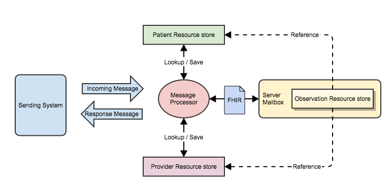

[原文链接:The Architecture and the (FHIR) Message](http://fhirblog.com/2015/03/24/the-architecture-and-the-fhir-message/)

## The Architecture and the (FHIR) Message    FHIR 消息：第四篇——FHIR 消息结构和内容的管理，服务器如何处理消息


**译者注:消息是医疗信息交换的一种重要模式，从HL7 V2 V3到X12等。对于已经应用了HL7 V2 消息的系统来讲，如何迁移到 FHIR 消息中来，是我们接下来要探讨的话题。

**

###  

之前探讨过的系统架构如下图所示：

除了上图中的模块之外，应该还要有一个EMPI 患者主索引用来管理患者标识，在跨机构的信息共享中尤其主要。如果一个患者拥有多个标识，只需要其中一个我们就可以获取患者的信息。

这里假设我们能够控制所有的模块，包括集成引擎、EMPI，fhir服务器，这样我们可以不必在集成引擎这里做患者、医务人员、encounter的查询(也就是途中的 Message processon模块)，直接在FHIR 服务器中做此类处理即可，可以提高性能、降低复杂度。同时我们也只关注患者，暂时忽略医务人员的标识管理(后续的话你就不能很好的解决某个住院医生所涉及的所有encounter等问题)。

这样子的话，我们可以把Patient资源(及其标识符)放在bundle里面，由服务器来直接管理标识信息。
对于Practitioner来说，可以直接用reference的display字段，reference(url)字段置空；也可以在Patient资源中造一个内嵌式的Practitioner，做一个reference即可。(但fhir spec中说bundle内的所有资源都是独立的 有各自标识的 这里的内嵌式 )

和V2消息一样，FHIR 消息也有各种类型，但是编码与V2中的是不一样的，目前定义好的消息类型[见此](http://www.hl7.org/implement/standards/fhir/messaging.html#events)。
根据第三篇中我们所提到的打算用到的V2消息和上面的FHIR消息类型的表格进行一些分类，

| 目的 | V2 消息 |  涉及的资源 |  FHIR消息类型 |
| Create an encounter | A01, A04, A05 | MessageHeader (1..1)Patient (1..1)Encounter (1..1)Condition (0..*)AllergyIntolerance (0..*)Procedure (0..*)Observation (0..*) | Admin-Notify |
| Update encounter details | A02, A03, A06, A07, A11, A12, A13, A38, A45, A50 | MessageHeader (1..1)Patient (1..1)Encounter (1..1) | Admin-Notify |
| Update clinical data | A08, A28 | MessageHeader (1..1)Patient (1..1)Encounter (1..1)Condition (0..*)AllergyIntolerance (0..*)Procedure (0..*)Observation (0..*) | Admin-Notify(?Clinical-Notify) |
| Change/Update Patient Identity | A31, A37, A40 | MessageHeader (1..1)Patient (1..2) | Admin-Notify (A31)Patient-link (A40)Patient-unlink (A37) |

注意：其中的Clinical-Notify 还不是一种正式的消息类型

利用上表中的消息类型 event type和所涉及的资源，集成引擎负责从V2消息中构建FHIR 消息，
由于集成引擎中布处理资源标识的问题，消息中的所有这些资源都回给一个cid，通过这个cid,服务器知道这些资源是新增的。

* MessageHeader资源中包含的是发送端和接收端进行交互时的传输相关的信息，比如消息发生的日期、创建消息的人、发送消息的系统、接收系统、产生消息的触发事件类型、消息的id等等。类似于V2 的MSH区段。
* Patient 包括了原始系统中的标识，可能会有姓名、其他人口统计学信息。A31消息是将患者标识符添加到EMPI中，我们的例子里面我们不考虑其中会包含临床数据的情况。A40消息和A37消息会涉及2个Patient资源，MessageHeader.event 的值决定了具体该如何处理，对于A40而言，将要被取代的那个Patient资源中有一个link字段，其中的值为取代这个Patient的资源( Patient.link.type值为replace)的地址，EMPI 负责完成更新操作，对于解除关联的操作，EMPI只需移除关联关系即可。
* Encounter记录这次就诊的信息，前面就提到过了，我们不会在消息转换时对Encounter做查询，也就是说消息中的Encounter都是新建的。Encounter.identifier也就是PV1-19中的vist number，Identifier数据类型这里我们用到两个属性，value(也就是PV1-19的值)和system(MSH-4和MSH-3组合起来得到)。由于它会有一个cid，我们需要告诉服务器到底它是新增还是更新操作。也就是使用FHIR中的条件更新，DSTU1 DSTU2中处理机制不同。DSTU1中只需在bundle的entry中添加一个如下的特殊'search-link'
```
<link href="http://localhost/Patient?[parameters]" rel="search"/>
````
DSTU2中你可以使用HTTP header中的属性If-None-Exist: base/[type]?[search parameters]来告诉服务器应该使用哪个参数查询到底有没有相应的资源 已经存在。到底是更新还是新增操作。
```
cid://encounter1?identifer={system}|{identifier}
````
<link href="http://localhost/Patient?[parameters]" rel="search"/>

In DSTU-2 it’s been more formally represented with the addition of conditional updates where you can specify the criteria to use to determine whether this is an update or a create in the id itself. In our case, we simply need to add the existing identifier (which is in the PV1-19 field) as a query parameter on the id, so the id of the Encounter resource in the bundle would be something like:

cid://encounter1?identifer={system}|{identifier}

We should also do this even when we do want a new encounter to be created – A01, A04 & A05. The reason is that if we were to get multiple encounters with the same identifier, then we will be unable to determine which one to update. In fact the conditional update specifies that if there are 2 or more resources matching the query parameter, then the update should fail.

Also, for an A50 (change identifier) we must be careful to specify the old identifier (from MRG-5) in this id (Interestingly, this is one situation where out-of-sequence messages are going to be a real headache – managing this is left to the implementer :) )

The other properties of the encounter will vary according to the message type – for example an A03 (discharge) will set the status to finished whereas many of the others will change the encounter type.

And now we can talk about the Patient id – it’s going to be the same, ie something like:

cid://patient?identifer={system}|{identifier}

The Condition resource represents the diagnosis for this visit. It is the same resource as used for a problem in a problem list, but the category is set to ‘diagnosis’. We’ll set the encounter property to refer to the encounter where it was asserted – this will allow us to provide views like the number of times that people were hospitalized for specific conditions.

There are 2 possible segments in the v2 message that can contain diagnosis information – the DG1 (Diagnosis Information) and the DRG (Diagnosis Related Group). These are both defined in chapter 6 of the v2 spec (which is all about financial information). We’ll only use the DG1 segments here, as the DRG is more about reporting and billing than clinical use.

As we decided earlier, we’re only going to update diagnoses related to a visit in 2 situations:

    When the encounter is first created
    When a specific ‘Update Patient Information’ message is received.

In addition, we’re going to treat updates as snapshots – we’ll assume that each update message has the complete list of diagnoses, so that means that when the server processes an update message it will first remove all current diagnoses for that visit (encounter), and then create new ones corresponding to the DG1 segments.

The Procedure resource is processed in a similar way to the diagnosis, being created by A01 messages, and updated as a snapshot by A08 and A28. It also has an encounter reference that we will set.

The Observation is also a snapshot based update, but we’re going to need to add an extension to link it back to its encounter. To tell the truth, I’m not entirely sure what observation based information we are going to get in ADT messages, but it is in there, so we may as well use it. It will need an extension to refer back to the encounter that created it.

So that covers off the resources – at least at a high level, we’ll go into more detail in the next post in this series. The last thing to think about before wrapping up this post is how the server will process these FHIR messages.

We’re using HTTP as the transport mechanism, and the endpoint of the server that processes the FHIR messages is called the mailbox. The FHIR specification doesn’t dictate how messages should be processed by the server (in the same way as the v2 specification doesn’t either) because that will be quite different depending on the nature and purpose of the application receiving the messages, so it’s worth thinking how that might happen in our case. (Of course the specification does go into detail about how the sender & the mailbox should interact)

It is the MessageHeader.event code that is the main trigger for determining the nature of server-side processing.

If the code is patient-link or patient-unlink, then the EMPI will be updated as we discussed above.

For admin-notify messages we have 3 main actions we could perform:

    Create a new Encounter and related clinical resources
    Update the Encounter
    Update the clinical resources

The last option does present some issues. The A08 message that is its source is all about changing patient data rather than encounter data. So; we need to have the Encounter resource in the FHIR message so we know which clinical resources to update, but we don’t want to update the encounter itself – which, by default, the server would do. One solution is to define our own event code, which we’ll call ‘clinical-notify’. We’re allowed to do this, because the MessageHeader.event binding has a type of incomplete – meaning we SHOULD use one of the defined codes, but we don’t HAVE to. The downside is that this is an event that only our server will recognize (unless this event type is added to the spec) so we’ve lost some interoperability. But in this case we’re the only consumer so that’s acceptable. (As an aside, we should raise a change request in the spec to suggest that this event type is added to the spec – if it’s an issue for is, it will likely be an issue for others).

So for admin-notify:

    Sender information and dates will come from the MessageHeader
    The id for the encounter will include the identifier (conditional updates), so it can determine whether to create a new encounter, or update an existing one.
    If there are clinical resources in the message, then they will be updated as a snapshot (against the encounter).

And for our very own clinical-notify (A08, A28):

    Sender information and dates will come from the MessageHeader
    The id for the encounter will include the identifier (conditional updates). There should be an existing encounter (which we won’t update) – if there isn’t then we’ll raise an error.
    Any clinical resources in the message will be updated as a snapshot (against the encounter).

Well, that’s quite enough for now – congratulations if you made it this far! Next post we’ll look in more detail at the mappings between the data from the v2 messages, and which resource properties they will update. We’ll also think about some other v2 messages we could consume (other than ADT) in our quest to generate useful clinical summaries.
Share this:

    TwitterFacebook2Google

Related

More FHIR Messaging: ADT messagesIn "Messaging"

Mapping HL7 Version 2 to FHIR MessagesIn "message"

FHIR: meet #CDAIn "Document/CDA"

Filed under Clinical, Messaging

About David Hay
I'm a Product Strategist at Orion Health, with a keen interest in health IT especially health interoperability with HL7 and the new FHIR standard.

2 Responses to The Architecture and the (FHIR) Message	

    Rene Spronk says:	
    March 28, 2015 at 2:29 am

    In DSTU2 (per statement from Grahame) cid: doesn’t work.. no clue as to whether that’s a temporary thing or not, we’ll have to wait and see.
    Reply	
    Rene Spronk says:	
    March 28, 2015 at 3:09 am

    As such it may be up to the integration engine to get hold or the URI of the resource that matches the search-criteria taken from the v2 message, and use that URI as a resource-reference in the translated version of a v2-message, instead of doing a straight transformation of v2 data to a resource.

    For now that may be a wise thing to do anyway, given that current FHIR servers are unlikely to support messaging any time soon..
    Reply	

Leave a Reply
Follow Blog via Email

Enter your email address to follow this blog and receive notifications of new posts by email.

Join 235 other followers

